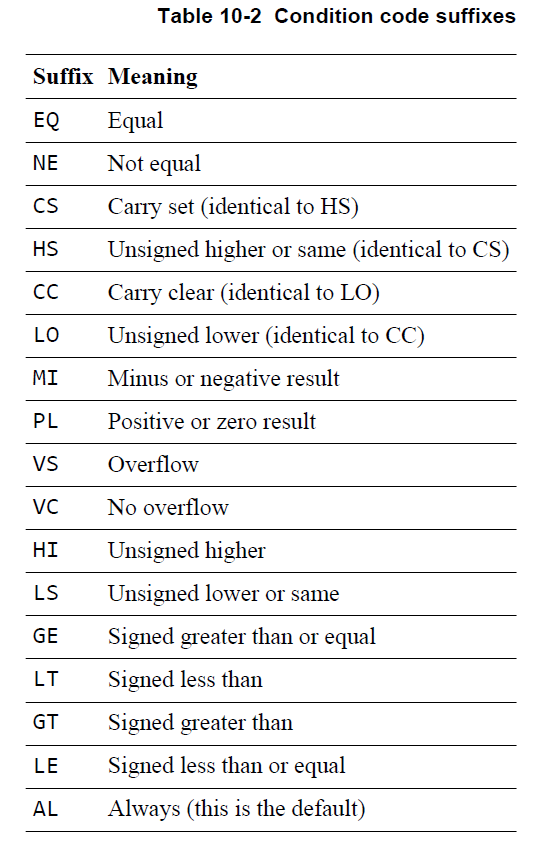
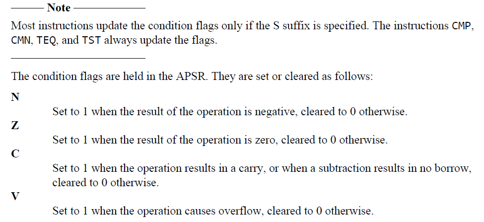

# ARM汇编

Operation{cond}{state} Rd,Rn,Operand2





向寄存器中一个值添加100

x86:`ADD eax,#100`

ARM:`ADD r0,r0,#100`

从一个寄存器指针加载到寄存器

x86:`MOV eax,DWORA PYR[ebx]`

ARM:`ldr r0,[r1]`

```assembly
#   AREA Example,CODE,READONLY
#   ENTRY
#   CODE32
#START
#
#   END
   AREA testhello,CODE,READONLY
   ENTRY
   CODE32
START
   ADD R1,R2,#4
   END
```

寻址方式：

1. 立即数寻址

   `ADD R0,R0,#0x3F`

2. 寄存器寻址

   `ADD R0,R1,R2`  ##MOV和ADD只能针对寄存器进行操作，无法操作内存中的地址

3. 寄存器间接寻址

   `LDR R0,[R1]`  ##将R1中存储的数作为地址，将该地址中的数赋值给R0

   `STR R0,[R1]`  ##将R0中的数存储在将R1中存储的数作为地址的内存中

4. 寄存器移位寻址

   `ADD R3,R2,R1,LSL #2` ##将R1左移两位加上R2赋值给R3                                                                                                                                             

5. 基地址寻址

   `LDR R0,[R1,#4]` ##将R1中存储的数加4作为地址，将该地址中的数赋值给R0

   `LDR R0,[R1],#4` ##将将R1中存储的数作为地址，将该地址中的数取出加4赋值给R0

   `LDR R0,[R1,R2]`

6. 多寄存器寻址

   `LDMIA R0,{R1,R2,R3,R4}`

7. 相对寻址

   `BL NEXT` ##跳转到NEXT处

   `MOV PC,LR`

超出0-255范围的立即数判断其是否被4整除

## 伪指令

### 伪指令的作用及类别

指令已经可以做各种类操作了，但操作比较麻烦。比如要做一个循环，就要用label结合BL不断进行，但如果要多次用到循环，就需要多次重新编写指令。

伪指令和定义了一些带参数的宏的操作一样，方便更好的实现汇编程序的逻辑。伪指令只在汇编器之前，汇编之后会翻译为标准的汇编指令集。

伪指令分为：ARM汇编伪指令和GNU汇编伪指令

### 基本常用伪指令

AREA、CODE16/32、ENTRY、END、EQU

EXPORT、IMPORT、EXTREN、GET、RN

### 在汇编语言程序中常用的符合

#### 符号命名约定

1. 符号区分大小写，同名的大、小写符号会被编译器认为是两个不同的符号
2. 符号在其作用范围内必须唯一
3. 自定义的符号名不能与系统的保留字相同
4. 符号名不应该与指令命或伪指令同名
5. 关于ADS里面的Tab和顶行

#### 符号、变量

GBLA/GBLL/GBLS（global arithmetic variable/global logical variable/global string variable）

LCLA/LCLL/LCLS（local arithmetic variable/local logical variable/local string variable）

SETA/SETL/SETS（sets the value of a local or global arithmetic variable/logical variable/string variable）

RLIST（gives a name to a set of general-purpose registers）
Use RLIST to give a name to a set of registers to be transferred by the LDM or STM instructions.

定义的变量都在内存中

#### 常量

1. 数字常量一般为32位的整数，当作为无符号数时，取值范围为0~4G-1，当作为有符号数时，其取值范围为-2G~2^30

2. 逻辑常量只有两种取值情况：真或假

3. 字符串常量为一个固定的字符串，一般用于程序运行时的信息提示

#### 变量代换$

程序中的变量可通过代换操作取得一个变量，代换操作符为“$”

```assembly
LCLS S1
LCLS S2
S1 SETS "Test!"
S2 SETS "This is a $S!";字符串变量S2的值为“This is a Test!”
```

#### 表达式和运算符

算数运算符：+、-、*、/、MOD

移位运算符：ROL、ROR、SHL、SHR

按位逻辑运算符：AND、OR、NOT、EOR

逻辑表达式及运算符：=、>、<、>=、<=、/=、<>、LAND、LOR、LNOT、LEOR

### 寄存器操作

LDR（某时候可以替代MOV、MVN）、ADR、ADRL

```assembly
LDR R0,=0x12;把0x12赋值给R0
ADR R0,=as;把as的地址赋给R0
```

### 数据定义伪指令

DCB、DCW、DCD、DCFD、DCFS、DCQ、SPACE、MAP、FIELD

### 控制伪指令

IF, ELSE, ENDIF, and ELIF、WHILE and WEND、MACRO and MEND、MEXIT

## 混合编程

### 为何要混合编程

1. 可扩展性、可维护性

2. 兼容性

### 汇编和C/C++混合编程的方式

1. 在C/C++代码中嵌入汇编指令
2. 汇编程序调用C/C++
3. C/C++调用汇编程序

### C语言嵌入汇编

格式：__asm[volatile]{instruction[;instruction]}

限制条件

1. 不能直接向PC寄存器赋值，程序跳转要使用B或者BL指令
2. 在使用物理寄存器时，不要使用过于复杂的C表达式，避免物理寄存器冲突
3. R12和R13可能被编译器用来存放中间编译结果，计算表达式值时可能把R0-R3、R12及R14用于子程序调用，因此避免直接使用这些物理寄存器

```c
void my_strcpy(char *src,char *dest){
    char ch;
    __asm{
        LDRB ch,[src],#1
        STRB ch,[dest],#1
        CMP ch,#0
        BNE loop
    }
}
int main(){
    char *a = "Hello!";
    char b[64];
    my_strcpy(a,b);
}
```

### C语言调用汇编

1. 汇编export
2. C语言定义extern function
3. C语言使用

C语言和汇编语言之间的参数传递是通过对应的R0-R3来进行传递，即R0传递第一个参数，R1传递第二个参数，多于4个参数时，借助栈来完成，函数的返回值通过R0来传递。这个规定叫作ATPCS（ARM Thumb Procedure Call Standard），具体见ATPCS规范。

```assembly
	AREA myARM,CODE,READONLY
	EXPORT my_strcpy
	
my_strcpy
loop
	LDRB R4,[R0],#1
	CMP R4,#0
	BEQ over
	STRB R4,[R1],#1
	B loop
over
	END
```

```c
extern void my_strcpy(char *src,chr *dest)
int main(){
    char *a = "hello!";
    char b[64];
    my_strcpy(a,b);
}
```

### 汇编调用C语言（用的比较多）

1. C语言实现函数
2. 汇编import函数名
3. BL函数名

```c
int main(int a,int b,int c){
    return a+b+c;
}
```

```assembly
	AREA myArm,CODE,READONLY
	IMPORT main
	ENTRY
start
	MOV R0,#1
	MOV R1,#2
	MOV R2,#5
	BL main
	MOV R4,R0
	END
```

