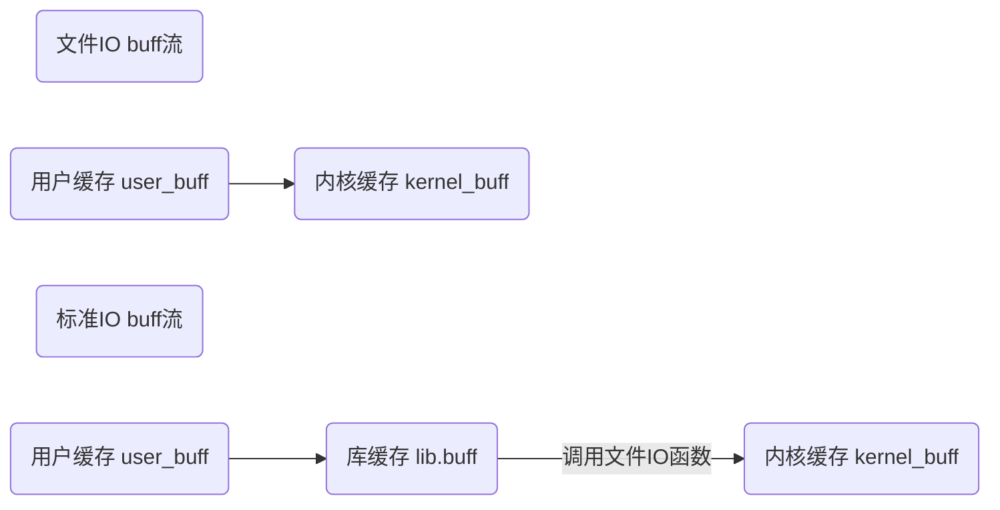
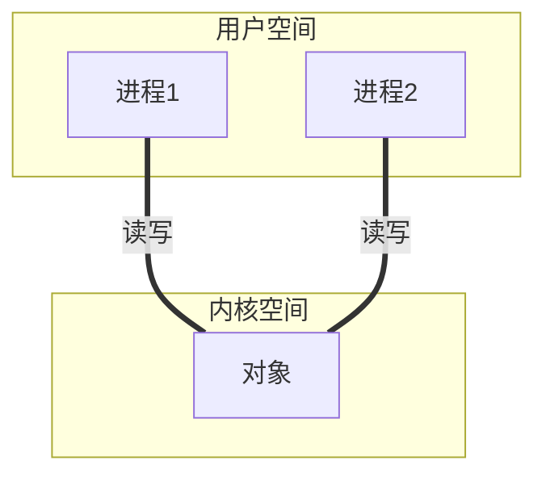
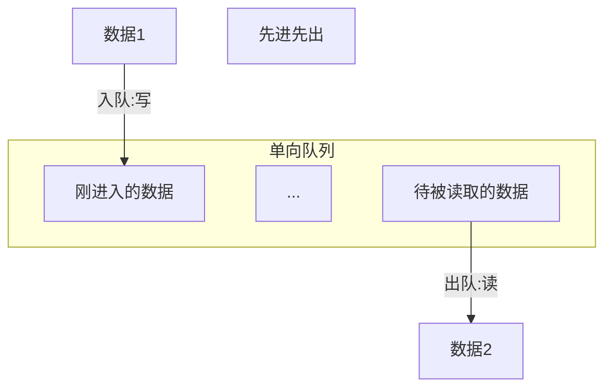
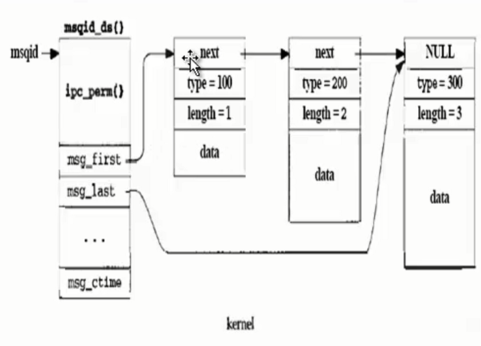

# 嵌入式学习2

Linux文件类型：普通文件（-）、目录文件（d）、链接文件（软连接l）、管道文件（p）、设备文件（c）、块设备（b）、s

## 系统编程

### 系统编程之IO

#### 文件IO

是从用户空间监督考虑的输入与输出

从内核读取数据或从文件中读取数据，叫：input  read函数

写数据到内核或写数据到文件中，叫：output		write函数

文件IO操作的4个函数：open、read、write、close

**掩码`umask`** 文件实际权限设置=设置权限&(~umask)

 lseek：调整读写位置指针

#### 标准IO

文件IO是直接调用内核提供的系统调用函数，头文件是unistd.h

标准IO是间接调用系统调用函数，头文件是stdio.h

文件IO识别不同文件时通过进程中文件的id号（文件描述符），在文件IO中打开一个进程时，内核默认建立三个文件描述符-->标准输入：0、标准输出：1、标准错误：2

标准IO识别不同文件时通过进程中文件的文件流指针（FILE *），FILE定义：struct_IO_FILE，在/usr/include/libio.h中，包含读写缓存的首地址、大小、位置指针等。

|          文件IO           |                标准IO                |
| :-----------------------: | :----------------------------------: |
|           open            |      fopen(默认设置权限时0666)       |
|           close           |                fclose                |
| lseek(返回文件的位置指针) | fseek(成功返回0，失败返回-11)\rewind |
|        write、read        |    读写函数分行、无、全缓存的情况    |
|       标准输入流 0        |                stdin                 |
|       标准输出流 1        |            stdout(行缓存)            |
|       标准出错流 2        |            stderr(无缓存)            |

ftell：用于取得当前的文件位置，调用成功则为当前文件位置指示，若出错则为-1L

三个缓存的概念（数组）

1. 我们的程序中的缓存，就是你想从内核读写的缓存（数组）-----用户空间的缓存

2. 每打开一个文件，内核在内核空间中也会开辟一块缓存，这个叫内核空间的缓存

   文件IO中的写即是将用户空间中的缓存写到内核空间的缓存中

   文件IO中的读即是将内核空间中的缓存写到用户空间的缓存中

3. 标准IO的库函数中也有一个缓存，这个缓存称为-----库缓存



库缓存有三种缓存：行缓存、无缓存、全缓存

1. 行缓存：遇到`\n`或者库缓存（行缓存 1024字节）写满，才将库缓存中的内容写入内核缓存
   
   1. 读：fgets、gets、printf、fprintf、sprintf
   
   2. 写：fputs、puts、scanf
   
      一个字符的读写（属于行、无、全缓存哪个，暂时未知）
   
   3. 读：fgetc、getc、getchar
   
   4. 写：fputc、putc、putchar
   
2. 无缓存：直接与内核缓存进行通讯

3. 全缓存：只有写满缓存再调用系统调用函数
   1. 读：fread
   2. 写：fwrite

```c
#include<stdio.h>
#inlcude<unistd.h>
int main(){
	char buff[] = "hello linux";
	printf("%s", buff);//没有\n，最后不会输出hello linux
	//write(1,buff,sizeof(buff));
	while(1);
	return 0;	
}
```

```c
#include<stdio.h>
#inlcude<unistd.h>
int main(){
	char buff[] = "hello linux";//user_buff
    for(int i = 0, i < 93, i++){
        printf("%s", buff);
    }
    printf("lu");//库缓存（行缓存）写满，输出
	while(1);
	return 0;	
}
```

printf遇到`\n`时或者库缓存（大小为1024字节）写满时，调用系统调用函数，将库缓存的内容写到内核中去

fclose：调用成功返回0，失败返回EOF，fclose在关闭文件之前，刷新缓存中的数据（比如行缓存没有/n或者没有写满的情况下，使用fclose同样会将行缓存的内容写进内核缓存），如果标准I/O库已经为该流自动分配了一个缓存，则释放此缓存

刷新缓存函数：fflush(FILE *fp)把库缓存中的内容**强制**写入内核缓存中。

gets和fgets的区别：

>gets只能从标准输入中读；gets不将新行符存入缓存中，fgets将新行符存入缓存中；gets()时不能指定缓存的长度，这样就可能造成缓存越界（输入行长于缓存长度），写到缓存之后的存储空间中，从而产生不可预测的后果

puts于fputs的区别：

>puts只能向标准输出中写；puts输出时会添加一个新行符，fputs不会添加

`fprintf、printf、sprintf`

>`fprintf`可以输出到文件中，也可以输出到显示器
>
>`printf`只能输出到显示器中
>
>`sprintf`输出内容到一个字符串中

`fgetc、fputc`

>`fgetc`：从文件中读取一个字符，正确返回为读取的字符
>
>`fputs`：写一个字符到文件中，成功则返回输入的字符
>
>>`fputs`有缓存，但**不是行缓存**函数

getc和fgets在出错或者到达文件结尾的情况下都会返回EOF，所以会产生歧义，需要对返回结果进行判别

`feof、ferror、clearerr`

>feof：判断是否已经到文件结尾，到达文件结尾返回非0，没有则返回0
>
>ferror：判断是否读写错误，是读写错误，返回为非0，不是则返回0
>
>clearerr：清楚流错误

实现显示cat命令（fputc、fgetc）：

```c
#include<stdio.h>
#include<string.h>

int main(int argc, char* argv[]){
    FILE *fp_src = NULL;
    char buf;
    if (argc < 2){
        printf("Input arguments is error!\n");
        return -1;
    }
    fp_src = fopen(argv[1],"r");
    if (fp == NULL){
        printf("Open the file failed!\n");
        return -2;
    }
    printf("Open the file sucess!\n");
    //start read write
    while(!feof(fp_src)){
        buf = fgetc(fp_src);
        fputc(buf,stdout);
        //printf("%c", buf);
        memset(buf, 0, 1);
    }
    fclose(fp_src);
    
    return 0;
}
```

fread、fwrite

>全缓存的读写函数
>
>返回值为实际读写的**单元数**，实际读写的大小由内核缓存的数量决定，因为标准IO是通过库缓存与内核缓存通信的，内核直接操作底层文件。

读写函数的效率：

|    文件IO    | 标准IO |       |        |
| :----------: | :----: | :---: | :----: |
|     read     | fgets  | fgetc | fread  |
|    write     | fputs  | fputc | fwrite |
| 内核时间：多 |   少   |  少   |   少   |
| 用户时间：少 |   多   |  多   |   多   |
|  效率：最低  |   高   |  低   |  最高  |


#### 目录IO

`#include<sys/types.h>、#include<dirent.h>`

对目录的读写操作

|                目录IO                 |       文件IO       |
| :-----------------------------------: | :----------------: |
|  opendir 只能打开目录/mkdir 创建目录  |        open        |
|            readdir 读目录             |        read        |
| rewinddir telldir seekdir调整位置指针 | rewind ftell fseek |
|           closedir 关闭目录           |       close        |

mkdir生成的目录权限仍然和umask有关系

```c
#include<stdio.h>
#include<sys/types.h>
#include<dirent.h>
int main(){
    int ret;
    DIR *dp;
    struct dirent *dir
    ret = mkdir("./mydir", 0777);
    if (ret < 0){
        printf("Make mydir failed!\n");
        return -1;
    }
    printf("Make mydir sucess!\n");
    dp = opendir("./mydir");
    if (dp == NULL){
        printf("Open mydir failed!\n");
        return -2;
    }
    printf("Open mydir sucess!\n");
    dir = readdir(dp);
    while(1){
      if (dir != NULL){
          printf("inode=%ld,name=%s\n",dir->d_ino,dir->d_name);
       }
        else
            break;
    }
    closedir(dp);
    
    return 0;
}
```

inode号：每个文件对应的ID号

#### 库函数的制作

Linux的库分为静态库、动态库（库函数目录：`/lib`、`/usr/lib`）

>静态库是以`.a`结尾的，`libxxx.a`
>
>>在**编译时**就将库编译进可执行程序中
>>
>>优点：程序的运行环境中不需要外部的函数库
>>
>>缺点：可执行程序大
>
>动态库是以`.so`结尾的，`libxxx.so`
>
>>在**运行时**将库加载到可执行程序中
>>
>>优点：可执行程序小
>>
>>缺点：程序的运行环境中必须提供相应的库

**静态库的制作**

1. 生成目标文件：`gcc -c file.c`

2. 静态函数库创建命令 ar

   `ar -cr libfile.a file.o`

   -c：create的意思

   -r：replace的意思，表示当插入的模块`file.o`已经存在`libfile.a	`中，则覆盖，反之ar显示一个错误

操作静态库的几个实例：

情况1：如果从别处得到一个静态库`libunknown.a`，想知道其中包含哪些模块：`ar -t libunknown.a`

静态库的编译（使用）：`gcc -o main main.c -L. -lfile`编译main.c就会把静态函数库整合进main

其中：-L 指定静态函数库的位置供查找，注意L后面还有`.`，表示静态函数库在本目录下查找；-l则指定了静态函数库名，由于静态函数库的命名方式是libxxx.a，其中的lib和.a忽略。

**动态库的制作**

1. 生成目标文件：`gcc -c file.c`

2. `gcc -shared -fpic -o libfile.so file.o`

   -fpic：产生位置无关代码

   -shared：生成共享库

使用：`gcc -o out main.c -L. -lfile`此时还不能立即`./out`，因为在动态函数库使用时，会查找`/usr/lib、/lib`目录下的动态函数库，而此时我们生成的库不在里边

第一种方法：`libfile.so`放到`/usr/lib`或者`/lib`中去

第二种方法（环境变量）：假设`libfile.so`在`/home/linux/file`中，使用`export LD_LIBRARY_PATH=/home/linux/file:$LD_LIBRARY_PATHLIBRARY_PATH=/home/linux/file:$LD_LIBRARY_PATH`

第三种方法：在`/etc/ld.so.conf`文件里加入我们生成的库的目录，然后`/sbin/ldconfig`；`/etc/ld.so.conf`是非常重要的一个目录，里面存放的是链接器和加载器搜索共享库时要检查的目录，默认是从`/usr/lib`、`/lib`中读取的，所以想要顺利运行，可以把我们库的目录加入到这个文件中并执行`/sbin/ldconfig`

#### 综合例子

单机上文件的上传和下载

1. 输入服务器的地址：路径和目录名

2. 列出服务器中有哪些文件：`opendir readdir`

3. 输入从服务器下载的文件名或者上传文件到服务器的文件名

4. 文件下载或者文件上传

   >文件IO：`open read write close`
   >
   >标准IO：`fputs fgets fputc fgetc fopen fread fwrite fclose`

```c
#include<stdio.h>
#include<sys/types.h>
#include<dirent.h>
#include<string.h>
#include<unistd.h>
#include<fcntl.h>
int main(){
    DIR *dp;
    struct dirent *dir;
    char server[128] = {0};
    FILE *fp_0, *fp_1;
    char file_d[128] = {0};
    char buff[128] = {0};
    int f_size;
    int fd;
  start:
    printf("Please input the server PATH and Directory name\n");
    scanf("%s", server);
    dp = opendir(server);
    if (dp == NULL){
        printf("Open the server:%s failed!\n", server);
        goto start;
    }
    printf("Open the server:%s sucess!\n", server);

    while(1){
        dir = readdir(dp);
        if (dir == NULL){
            printf("Read the %s failed!\n", server);
            break;
        }
        else{
            printf("inode=%ld,\tname=%s\n", dir->d_ino, dir->d_name);
        }
    }

    printf("\nPlesse input the filename to download:");
    scanf("%s", file_d);
    
    //Open server file
    fp_0 = fopen(strcat(strcat(server,"/"),file_d), r);
    if (fp_0 == NULL){
        printf("Open the download %s failed!\n", file_d);
        return -1;
    }
    printf("Open the download %s sucess!\n", file_d);
    fp_1 = fopen(file_d, w+);
    if (fp_1 == NULL){
        printf("Creat the %s failed!\n", file_d);
        return -2;
    }
    printf("Creat the %s sucess!\n", file_d);
    do{
        f_size = fread(buff,sizeof(char), sizeof(buff),fp_0);
        fwrite(buff,sizeof(char),sizeof(buff),fp_1);
        memset(buff, 0, sizeof(buff));
    }while(f_size == sizeof(buff))
    fclose(fp_0);
    fclose(fp_1);
    closedir(dir);
    
    return 0;
}
```

### 进程通信

#### 概述

进程通信：在用户空间实现进程通信是不可能的，通过Linux内核通信

线程通信：可以在用户空间就可以实现，可以通过全局变量通信

Linux内核中的对象不一样，通讯方式就不一样，几种通信方式：

1. 管道通信：无名管道、有名管道（文件系统中有名）

2. 信号通信：信号（通知）通信包括信号的发送、信号的接收和信号的处理

3. IPC（Inter-Process Communication）通信：共享内存、消息队列和信号灯

   以上是单机模式下的进程通信（只有一个Linux内核）

   Socket通信：存在于一个网络中两个进程之间的通信（两个Linux内核）

每一种通信方式都是基于文件IO的思想

>open功能：创建或者打开进程通信对象。函数形式不一样，优点是由多个函数完成
>
>write功能：向进程通信对象中写入内容。函数形式可能不一样
>
>read功能：从进程通信对象中读取内容。函数形式可能不一样
>
>close功能：关闭或者删除进程通信对象。形式可能不一样

#### 通信原理

线程通信：


进程通信：



**对象**不一样，通讯方式就不一样

##### 无名管道

文件系统中无文件节点（无文件名称）

管道是一个队列（顺序队列），管道由内核创建，在内核空间中



管道文件是一个特殊的文件，是由队列来实现的

在文件IO中创建一个**文件**或者打开一个**文件**是由open函数来实现的，它不能创建**管道文件**；只能用pipe函数来创建管道。

不同于文件IO中的open函数，创建文件需要文件名称、打开模式或者权限，但是**都会返回文件描述符**。

函数形式：`int pipe(int fd[2])`

参数：就是得到的文件描述符。由两个文件描述符：fd[0]代表读和fd[1]代表写，管道有一个读

```c
#include<stdio.h>
#include<unistd.h>
#include<stdlib.h>
int main(){
    int fd[2];
    int ret;
    char write_buf[] = "hello linux";
    char read_buf[128] = {0};
    ret = pipe(fd);//创建管道
    if (ret < 0){
        printf("Create pipe failed!\n");
        return -1;
    }
    printf("Create pipe sucess!\n fd[0]=%d,fd[1]=%d\n", fd[0],fd[1]);//fd[0]和fd[1]为文件描述符，fd[0]=3，fd[1]=4
    write(fd[1],write_buf,sizeof(write_buf));
    read(fd[0],read_buf,sizeof(write_buf));
    printf("readbuf=%s\n", read_buf);
    close(fd[0]);
    close(fd[1]);
    return 0;
}
```

注意：

1. 管道是创建在内存中的，进程结束，空间释放，管道就不存在了；
2. 管道中的东西，读完了就删除了；
3. 如果管道中没有东西可读，则会读阻塞（S）；
4. 内核开辟的管道是有一定大小的 

无名管道的缺点：不能实现不是父子进程（亲缘关系）之间的通信。

##### 有名管道

 正是由于无名管道的缺点，对无名管道进行改进：有名管道。所谓的有名，即文件系统中存在文件节点（有文件名称），每一个文件节点都有一个`inode`号

而且这是一个特殊的文件类型：管道类型（p）

1. 创建这个文件节点，不可以通过open'函数，open函数只能创建普通文件，不能创建特殊文件（管道-`mkdifo`，套接字-`socket`，字符设备文件-`mknod`，块设备文件-`mknod`，符号链接文件-`ln -s`，目录文件-`mkdir`）
2. 管道文件只有`inode`号，不占磁盘块空间，和套接字、字符设备文件、块设备文件一样；而普通文件和符号链接文件、目录文件，不仅有`inode`号，还占磁盘块空间。
3. `mkfifo`用来创建管道文件的节点，没有在内核中创建管道。只有通过open函数打开这个文件时，才会在内核空间创建管道

##### 信号通信

信号早内核种是已经存在的，通过`kill -l`查看；信号是由内核发出的，用户空间的进程不能够发出信号，用户空间的进程可以通过系统调用接口告诉内核：1. 向用户空间的哪个进程发信号 （通过PID号确定）2. 发什么信号（64种信号）

信号通信的框架

1. 信号的发送（发送信号进程）：kill、raise（发信号给自己）`raise(9)相当于_exit()，而不是exit()`、alarm（只能发送给当前进程，定时一段时间之后发送信号）
2. 信号的接收（接受信号进程）：`pause()、sleep、while()`三个函数保证进程存在
3. 信号的处理（接受信号进程）：signal

```c
#include<stdio.h>
#include<stdlib.h>
#include<unistd.h>
#include<signal.h>
#include<sys/types.h>
int main(int argc, char *argv[]){
    int sig, pid;
    if(argc < 3){
        printf("Please input param!\n");
        return -1;
    }
    sig = atoi(argv[1]);
    pid = atoi(argv[2]);
    printf("PID=%d,SIG=%d\n", pid, sig);
    kill(pid, sig);
    return 0;
}
```

```c
#include<stdio.h>
#include<sys/types.h>
#include<signal.h>
#include<stdio.h>
#include<stdlib.h>
int main(){
    pid_t pid;
    pid = fork();//此处返回的pid为子进程的pid
    if(pid > 0){
        sleep(8);
        if(waitpid(pid,NULL,WNOHANG) == 0){
            kill(pid,9);//杀死子进程
            //pid是在父进程中创建的子进程，在父进程中杀死pid，pid就是子进程了
        }
        wait(NULL);//回收子进程的资源，子进程不会进入僵尸状态，但wait是阻塞进程
        while(1);
    }
    if(pid == 0){
        printf("Raise function before.\n");
        raise(SIGTSTP);
        printf("Raise function after.\n");
        exit(0);
    }
    return 0;
}
```

信号处理

signal函数有两个参数，第一个参数是一个整型变量（信号值），传达什么信号；第二个参数是一个函数指针，是我们自己写的处理函数，即怎么处理信号；函数的返回值是一个函数指针。

```c
#include<stdio.h>
#include<signal.h>
#include<sys/types.h>
#include<stdlib.h>
void myfun(int sign_num){
    for (int i = 0, i < 10, i++){
        printf("The signal num:%d\n", sign_num);
        sleep(1);
    }
    return;
}
int main(){
    printf("Signal before!\n");
    signal(14,myfun);//告诉内核收到alarm信号后的处理方式（alarm信号数为14）
    alarm(9);
    printf("Signal after!\n");
    for(int i = 0, i < 10, i++){
        printf("Process i = %d\n",i);
        sleep(1);
    }
    return 0;
}
```

##### IPC

IPC（Inter-Process Communication）通信和文件IO类似，IPC通信需要在内核中创建IPC，进行读写，最后关闭（删除）IPC。

查看IPC对象: `ipcs -m`查看共享内存，`ipcs -q`查看消息队列，`ipcs -s`查看信号灯

删除IPC对象 `ipcrm -m/-q/-s id`


|   文件I/O   |                  IPC                   |
| :---------: | :------------------------------------: |
|    open     |       `Msg_get、shmget、semget`        |
| read、write | `msgsnd、msgrecv、shmat、shmdt、semop` |
|    close    |      `msgctrl、shmctrl、semctrl`       |

##### 共享内存

`shmget`（share memory）：共享内存的创建或者打开，共享内存实际是内核中的缓存，类似C语言的数组。

```c
int main(){
    int shm_id;
    int key;
    char *p;
    key = ftok("./a.c",'a');//生成key
    //key_t ftok(const char *pathname, int proj_id);
    if (key < 0){
        printf("Create key failed!\n");
        return -2;
    }
    printf("Create key sucess!key=%X\n",key);
    //shm_id = shmget(IPC_PRIVATE,128,0777);
    shm_id = shmget(key,128,IPC_CREAT | 0777);
    if(shm_id < 0){
        printf("Create share memory failed!\n");
        return -1;
    }
    printf("Create share memory sucess!\n");
    printf("shm_id=%d\n",shm_id);
    system("ipcs -m");//查看系统中的共享内存
    p = shmdt(shm_id,NULL,0);//映射共享内存
    if (p == NULL){
        printf("shmat function failed!\n");
        return -3;
    }
    printf("shmat function sucess!\n");
    //write share memory
    fgets(p,128,stdin);
    //start read share memory
    printf("firet read share memory data:%s\n",p);
    printf("second read share memory data:%s\n",p);
    //system("ipcrm -m shm_id");//删除系统中的共享内存
    //system()中的内容，类似于在终端中输入的命令
    shmdt(p);//将用户空间内进程里的地址映射删除
    shmctl(shm_id,IPC_RMID,NULL);//删除内核空间中的共享内存对象
    
    return 0;
}
```

`int shmget(key_t key, size_t size, int shmflg);`

key：有两种来源1. IPC_PRIVATE 2.使用`ftok`自己创建的key

IPC_PRIVATE操作时，共享内存的key值都一样，都是0，通过该参数创建的共享内存，其访问方式类似无名管道，存在亲缘关系；而用`ftok`函数来创建，会得到不同的key值，其访问方式类似有名管道，不存在亲缘关系。

只要key值一样，用户空间的进程通过这个函数打开，则会对内核的同一个IPC对象操作。

`shmat`：为了方便用户空间对共享内存的操作，将共享内存映射到用户空间的地址中，使用地址映射的方式

`void *shmat(int shmid, const void *shmaddr, int shmflg);`

第三个参数`shmflg`：`SHM_RDONLY`共享内存只读，默认是0，表示共享内存可读写

`shmdt`：将用户空间内进程里的地址映射删除

`shmctl`：删除内核空间中的共享内存对象

`int shmctl(int shmid, int cmd, struct shmid_ds *buf);`

> cmd：IPC_STAT（获取对象属性）、IPC_SET（设置对象属性）、IPC_RMID（删除对象）
>
> buf：指定IPC_STAT/IPC_SET时用以保存/设置属性

共享内存的特点：

1. 共享内存创建之后，一直存在于内核中，直到被删除或者系统关闭
2. 共享内存和管道不一样，读取后，内容仍在其共享内存中

```c
#include<stdio.h>
#include<signal.h>
#include<unistd.h>
#include<stdlib.h>
void mufun1(int){
    return;
}
void myfun2(int){
    fputs(p,128,stdout);//从共享内存中读出
    kill(getppid(),SIGUSR2);
    return;
}
int main(){
    int shmid;
    pid_t pid;
    char *p;
    shmid = shmget(IPC_PRIVATE,128,0777);//创建共享内存
    if (shmid < 0){
        printf("Create share memory failed!\n");
        return -1;
    }
    printf("Create share memory sucess!\n");
    p = (char *)shmat(shmid,NULL,0);//内存映射
    pid = fork();//生成子进程
    if (pid > 0){
        signal(SIGUSR2,myfun)
        fgets(p,128,stdin);//向共享内存中写入
        kill(pid,SIGUSR1);
        pause();
    }
    else if(pid == 0){
        signal(SIGUSR1,myfun_2)
        pause();
        printf("Child process!\n");
    }
    else{
        printf("Parent process!\n");
    }
    
    shmdt(p);//删除用户空间的内存映射
    shmctl(shmid,IPC_RMID,NULL);//删除内核中的共享内存
    return 0;
}
```

不存在亲缘关系的进程间的通信

server：

```c
struct mybuff {
    int pid;
    char buf[124];
};
void myfun(int shmid){
    return;
}
int main(){
    int key;
    int shmid;
    int pid;
    struct mybuff *p;
    key = ftok("./a.c",'a');
    shmid = shmget(key,128,IPC_CREAT);
    if (shmid < 0){
        printf("Create the share memory failed!\n");
        return -1;
    }
    printf("Create the share memory sucess!\n");
    p = (struct mybuff *)shmat(shmid,NULL,0);
    if (p == NULL){
        printf("shmat function failed!\n");
        return -2;
    }
    printf("shmat function sucess!\n");
    signal(SIGUSR2,myfun);
    
    p->pid = getpid();//write pid to the share memory
    //getpid()用来取得目前进程的进程识别码
    pause();//wait client to read server pid and write client pid to the share memory
    pid = p->pid;//read the pid of the client
    while(1){
        printf("Parent process start write share memory:\n");
        fgets(p->buf,124,stdin);
        kill(pid,SIGUSR1);
        pause();//wait client read
    }
    
    return 0;
}
```

client：

```c
struct mybuff {
    int pid;
    char buf[124];
};
void myfun(int shmid){
    return;
}
int main(){
    int key;
    int shmid;
    struct mybuff *p;
    key = ftok("./a.c",'a');
    shmid = shmget(key,128,IPC_CREAT);
    if (shmid < 0){
        printf("Create the share memory failed!\n");
        return -1;
    }
    printf("Create the share memory sucess!\n");
    p = (struct mybuff *)shmat(shmid,NULL,0);
    if (p == NULL){
        printf("shmat function failed!\n");
        return -2;
    }
    printf("shmat function sucess!\n");
    signal(SIGUSR1,myfun);
    
    pid = p->pid//read the server pid
    p->pid = getpid();//write client pid to the share memory
    kill(pid,SIGUSR2);
    while(1){
        pause();//wait server write
        printf("clinet process receive date from share memory:\n");
        fputs(p->buf,stdout);
        kill(pid,SIGUSR2);
    }
    
    return 0;
}
```

##### 消息队列



内核中的消息队列是链式队列，读取后删除，类似管道，读就是删除，写就是插入。

`msqid_ds`是内核维护消息队列的结构体，队列的第一个消息指针msg_first，最后一个消息指针msg_last，消息中有一个成员指针`next`

每一个消息中包含有哪些内容：Data 数据、length 数据长度、type 数据的类型

`ipcs -q`查看消息队列

| 消息队列 | 文件I/O |
| :------: | :-----: |
|  msgget  |  open   |
|  msgctl  |  close  |
|  msgsnd  |  write  |
|  msgrcv  |  read   |

消息队列的特点：1.消息队列读完后就删除（出队）2.设置阻塞方式，当消息队列中没有被读的数据时，读处于阻塞状态


##### 信号灯

信号量集合（可以包含多个信号量），IPC对象时一个信号灯集（多个信号量）