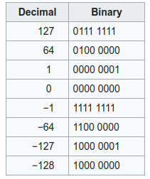

反码：负数的反码是将其原码的**符号位保持不变**，其余为按位取反

补码：负数的补码为它的反码加1

补码系统的最大优点是可以在[加法](https://zh.wikipedia.org/wiki/加法)或[减法](https://zh.wikipedia.org/wiki/減法)处理中，不需因为数字的正负而使用不同的计算方式。只要一种加法电路就可以处理各种有号数加法，而且减法可以用一个数加上另一个数的补码来表示，因此只要有加法电路及补码电路即可完成各种有号数加法及减法，在电路设计上相当方便。另外，补码系统的0就只有一个表示方式，这和[反码](https://zh.wikipedia.org/wiki/一補數)系统不同（在反码系统中，0有二种表示方式），因此在判断数字是否为0时，只要比较一次即可。

`-128`  原位：无，反码：无，补码：10000000

反码只能表示0到127,-0到-127

补码再次取补得到它的原码（先求反码，再+1）

[-Y]补码等于对[Y]补的每一位包括符号位在内，按位取反再加1

最高位和次高位相等Cn-1=Cn-2，运算结果正确，不相等，结果不正确，即
$$
\mathbf{C}_1\bigoplus\mathbf{C}_2 = 1
$$
溢出

CS（Code Segment）

DS（Date Segment）

SS（Stack Segment）

ES（Extra Segment）

IP（Instruction Pointer）

8088 有 20 根地址线，可寻址的最大内存空间为 2^20=1MB，地址范围为 00000H~FFFFFH。每个存储单元对应一个 20 位的地址，这个地址称为存储单元的物理地址。每个存储单元都有唯一的一个物理地址。

 根据段基址可以确定程序在内存中的哪个区间，但是，并不能确定任意一个内存单元的物理地址，因此增加了段内偏移量（段内各存储单元地址相对于该段起始单元地址的位移量）；程序中使用的存储器地址是由段基址和内偏移地址组成，这种在程序中使用的地址称为 逻辑地址，通常写成XXXXH:YYYYH的形式，其中 XXXXH 为段基址， YYYYH 为段内偏移地址。

程序指令中一般只给出偏移地址信息，它对应的段基址存在段寄存器中

二进制逻辑左移一位，相当于乘以2（二进制的基数）；逻辑右移一位，相当于除以2（二进制的基数）

二进制，测试一个数是奇数还是偶数，只要看第0位是不是1就行，是1就是奇数，为0就是偶数