# ARM硬件基础

## ARM基础概述

硬件原理和构造、通信协议、时长/频率

1. 研究ARM文档
2. 研究厂家芯片文档
3. 研究外设厂家文档

硬件分类：

1. CPU核心：NEON/SIMD、Cache
2. 系统外围：RTC（real time clock）、PLL（Phase Locked Loop：锁相环）、PWM Timer（Pulse Width Modulation：脉冲宽度调制）、Watchdog Timer、DMA（直接内存访问）、Keypad、ADC
3. 连接：USB Host/OTG、UART、IIC、SPI、Modem IF（interface）、GPIO、Audio IF、Storage IF
4. 多媒体：Camera IF/MIPI CSI、Coder/Decoder、2D/3D Graphics Engine、TV out/HDMI、JPEG Code、LCD Controller
5. 存储接口：SRAM/SROM、OneNand、SLC/MLC Nand、DDR
6. 电源管理：Clock Gating、Power Gating、Frequency Scaling

常见分为以下几类：

1. GPIO（General-purpose input/output）：通用型输入输出
2. 协议：UART、USB、I2C、SPI等
3. 控制器（Nand Flash控制器等）和转换器（ADC、DAC等）

## SIMD&NEON

SIMD（Single Instruction Multiple Data：单指令多数据流）

NEON是基于SIMD的改进，技术可加速多媒体和信号处理算法

## Cache

为什么需要Cache

1. 主存速度跟不上CPU的发展
2. 主存一般都是片外，频繁进出速度慢、能耗高
3. I/O向主存请求的级别高于CPU访存

程序访问的局部性原理，采用SRAM；命中率，大小比例：4：1000->128K:32M

内存层级

缓存控制器Cache Controller：直接映射缓存Direct Mapped Cache、联合缓存Set-associative Cache

缓存结构总结

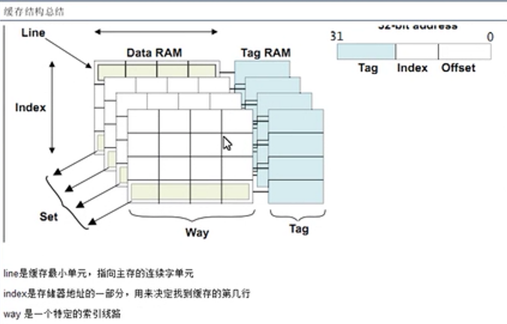

## MMU存储管理单元

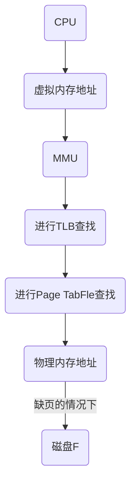

虚拟存储器

1. 作用：允许多道程序之间有效安全的共享存储器、清楚一个小而受限的主存容量对程序设计造成的影响
2. 虚拟地址，物理地址，页（4-16K的大小），缺页
3. MMU进行页保护及锁定机制
4. 地址转换过程
5. 分段

页的存放和查找

缺页

1. 如果不缺页，直接读物理内存
2. 如果缺页，则把控制权交给操作系统，操作系统一般是从磁盘地址去取

加快地址转换TLB（TLB是快表：为页表的Cache，存储了最可能被访问到的页表项，省去了查找整个页表的时间）

1. 页在主存中，只需要创建缺失的TLB表项
2. 页不存在主存中，需要将控制权交给操作系统来解决缺页

集成虚拟存储器，TLB，Cache

SRAM、DRAM、ROM

## 中断体系结构

**ARM异常种类及对应的处理器模式**

ARM体系结构中存在7种异常处理。异常发生时，处理器会把PC指向一个特殊地址，这个地址放在存储器中一个特定表中，称为向量表

|    地址    |    异常    |  进入模式  | 描述                                                         |
| :--------: | :--------: | :--------: | :----------------------------------------------------------- |
| 0x00000000 |    复位    |  管理模式  | 复位电平有效时，产生复位异常，程序转到复位处理程序处执行     |
| 0x00000004 | 未定义指令 | 未定义模式 | 遇到不能处理的指令时，产生未定义指令异常                     |
| 0x00000008 |  软件中断  |  管理模式  | 执行SW指令产生，用于用户模式下的程序调用特权操作指令         |
| 0x0000000C |  预存指令  |  中止模式  | 处理器预取指令的地址不存在，或该地址不允许当前指令访问，产生指令预取中止异常 |
| 0x00000010 |  数据操作  |  中止模式  | 处理器数据访问指令的地址不存在，或该地址不允许当前指令访问时，产生数据中止异常 |
| 0x00000014 |   未使用   |   未使用   | 未使用                                                       |
| 0x00000018 |    IRQ     |    IRQ     | 外部中断请求有效，且CPSR中的I位为0时，产生IRQ异常            |
| 0x0000001C |    FIQ     |    FIQ     | 快速中断请求引脚有效，且CPSR中的F位为0时，产生FIQ异常        |

 0x00000000开始的地址为低地址向量表：裸板开发

0xffff0000开始的地址为高地址向量表

**异常发生时CPU的处理步骤**

1. 保存当前执行位置（LR）
2. 保存当前执行状态（CPSR）
3. 寻找中断入口，即向量表地址（PC）
4. 执行中断处理程序
5. 中断返回，继续执行

复位异常、未定义指令异常、软中断异常、预取异常、数据异常、外部中断异常、快速中断异常

```assembly
;复位异常发生时伪指令
R14_svc = UNPREDICTABLE value
SPSR_svc = UNPREDICTABLE value
CPSR[4:0] = 0b10011;进入特权模式
CPSR[5] = 0;使用ARM指令
CPSR[6] = 1;禁用快速中断模式
CPSR[7] = 1;禁用外部中断模式
if high vectors configured then
	PC = 0xffff0000
Else
	PC = 0x00000000
```

```assembly
;未定义指令异常伪指令
R14_und = address of next instruction after undefined instruction
SPSR_und = CPSR
CPSR[4:0] = 0b11011;进入特权模式
CPSR[5] = 0
CPSR[7] = 1
if high vectors configured then
	PC = 0xffff0004
Else
	PC = 0x00000004
```

**ARM异常优先级**

| 优先级 |            异常            |
| :----: | :------------------------: |
|   1    |           Reset            |
|   2    |         Data Abort         |
|   3    |            FIQ             |
|   4    |            IRQ             |
|   5    |       Prefetch Abort       |
|   6    | SWI、Undefined Instruction |

## ARM启动顺序

程序链接地址：程序在内存中运行的地址

程序地址：程序存储的地址

IROM：程序可直接在其上运行

1. 运行IROM代码
2. 搬运bootloader第一段代码到ISRAM运行
3. 第一段代码搬运bootloader第二段代码到ISRAM运行
4. 第二段bootloader搬运OS到DRAM（内存）中运行

## 接口编程的准备工作

### 了解开发板资源

1. 找CPU，用什么样架构的CPU，为了找到系统上电后，第一条执行的代码，我们该放到哪里

   ARM：异常向量表的地址固定（reset异常地址为0x0）

   通过执行函数主动打断CPU为异常，外界因素突然间打端CPU为中断

2. 0x0接的是什么芯片（具有可读和保存的性质）：Flash（Nor-flash）、ROM

   SOC = CPU + Controler(控制器)

   1. datasheet block

3. 地址都被芯片公司重新定义了，去芯片公司的datasheet中寻找memory map找重定义的位置

   **总的选择过程**：CPU发出地址，地址经过地址选择器，地址选择器确定发出的地址的是在那一块地址区间，对选定的地址区间进行访问；如果访问的地址属于片外地址，并且片外地址有多个分块的情况下，地址选择器一般通过CS（chip select）引脚，使地址对应的片外芯片使能（片选功能），其他芯片disable，实现在有限的外部地址总线的情况下，对多个外部芯片的访问

   DRAM在

   片内资源：一般寻找片内寄存器SFR

   片外资源：

   ​	**方法**：芯片是否挂载地址总线或者数据总线；如果挂载了，就先寻找该芯片类似CS/enable功能的片选引脚，查看该引脚对应CPU上的哪个引脚，然后查看那些地址可控制该引脚；否则寻找片内控制器。

   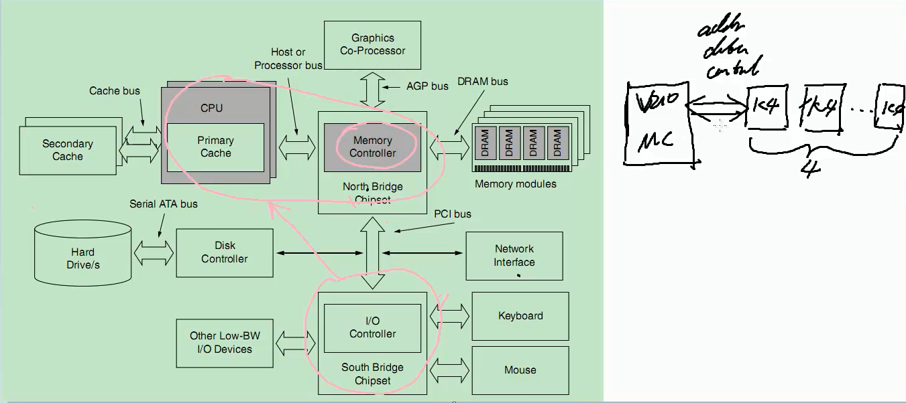

   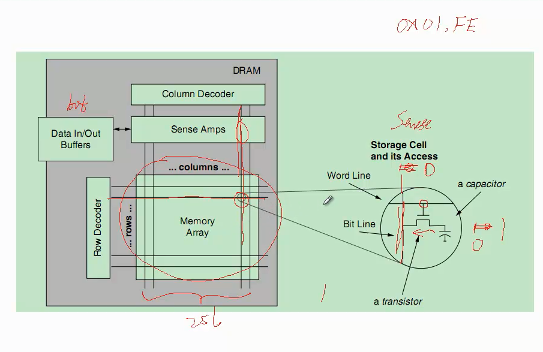

   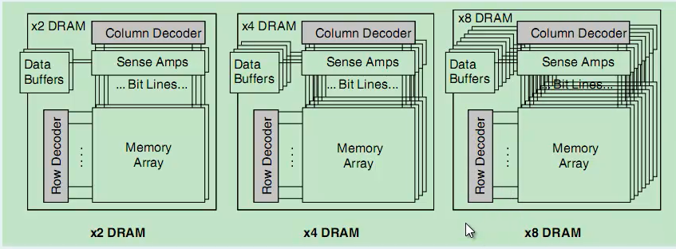

   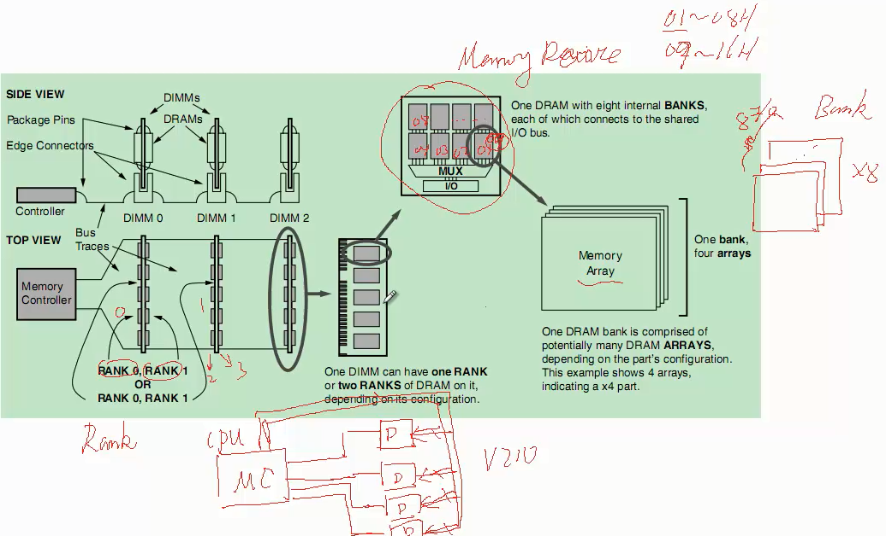

   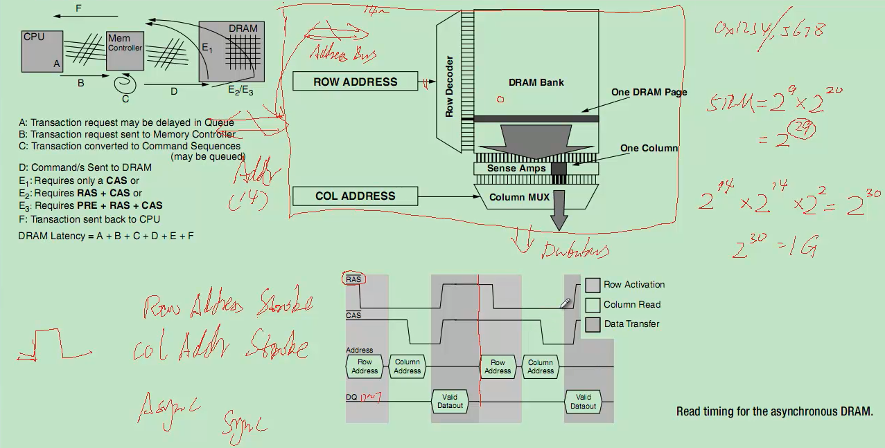

   DRAM（Dynamic Random Access Memory）依靠内部的小电容充放电进行存储，由于内部电容很小，所以需要对DRAM内存进行周期性的更新（读取电容的值，将该值重新回写），防止电容漏电，数据消失；因此DRAM的控制器相比SRAM（Static Random-Access Memory）更复杂。

   > DRAM（动态随机存取存储器）空间
   >
   > 分块	每一个分块[起始地址---结束地址] 
   >
   > 程序访问的地址，落在哪个分块区间上，CPU就通过CS（chip select）引脚来自动的对该分块的片选信号置为有效
   >
   > SDRAM（同步动态随机存取内存），相比DRAM多了时钟信号，进行同步

   > SRAM（Static Random-Access Memory：静态随机存取存储器）
   >
   > 其保存一个位的数据，需要用到四到六个晶体管；而DRAM只需要一个小电容，所以DRAM的容量一般比SRAM的大。

   >DDR（Double Data Rate）双倍速率，其速率是普通RAM速率的两倍

   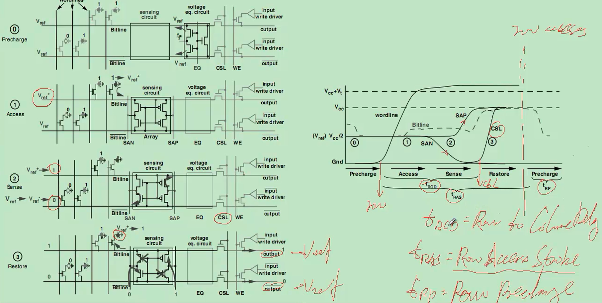

   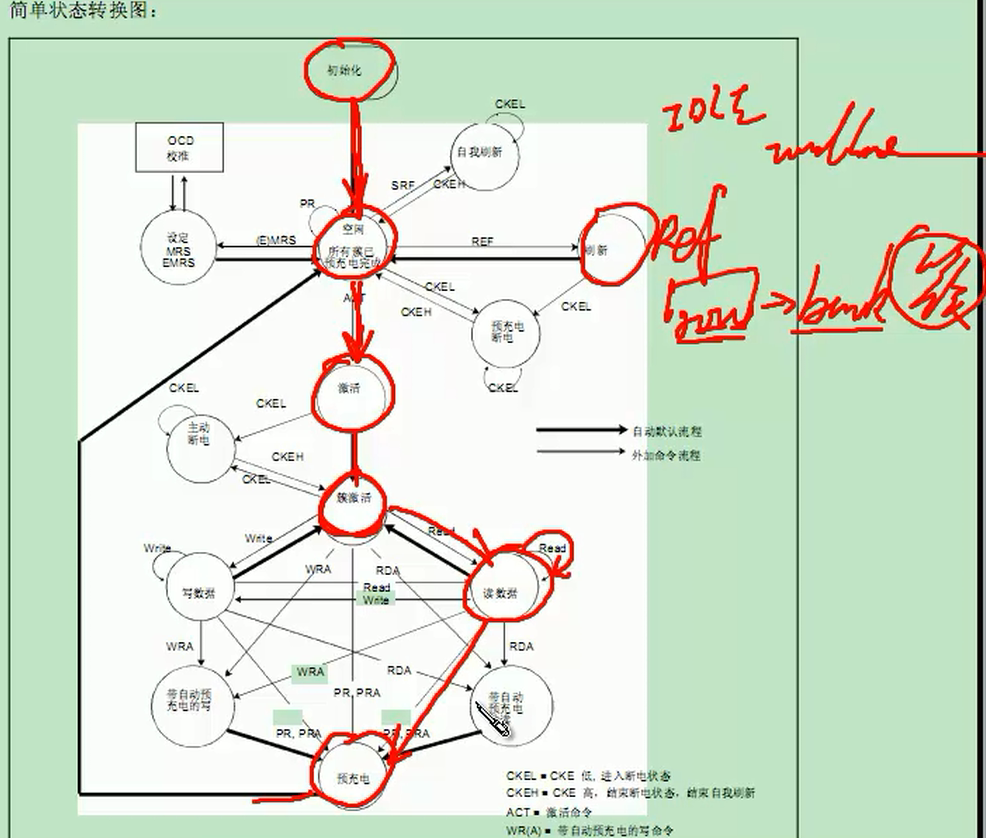

   DDR初始化reg配置：

   |    缩写     | 全称                                                         |
   | :---------: | ------------------------------------------------------------ |
   |   t_refi    | Average Periodic Refresh Interval                            |
   |    t_rfc    | Refresh Cycle time                                           |
   |    t_rrd    | Row activation to Row activation Delay                       |
   |    t_rp     | Row Precharge                                                |
   |    t_rcd    | Row to Column command Delay                                  |
   |    t_rc     | Row Cycle                                           t_rc = t_ras + t_rp |
   |    t_ras    | Row Acess Strobe                                             |
   |    t_wtr    | Write to Read delay time                                     |
   |    t_wr     | Write Recovery time                                          |
   |    t_rtp    | Ready to Precharge                                           |
   | t_cl(t_cas) | Column Acess Strobe latency                                  |
   |    t_faw    | Four Active Window                                           |
   |    t_al     | Added Latency to column access                               |
   |  **t_rl**   | **t_rl = t_al + t_cl**                                       |
   |    t_wl     | t_wl = t_rl - 1                                              |

   DMC：Dynamic Memory Controller

   DQ：数据

   DQS：源同步时钟

   DLL：Delay Locked Loop延时锁环

   PLL：Phase Locked Loop锁相环

   

   SDRAM

   1. 找到对应芯片，找该芯片的类似于cs/enable这样的引脚，看该引脚接到CPU的哪个片选信号上。XMLCSN0---DRAM BANK0---0x2000 0000

   Network：同样的方式确定得到0x8800 0000

   找异常向量表中reset向量的地址对应的是什么东西

   0x0 --- IROM --- Code --- Jump to new addr

   cpu arm --- 0x0 --- SROM（bank0）--- bank0挂载的是什么芯片

4. boot程序

   设置时钟clock

5. 接口开发（boot+interface）代码开发

### bootloader的作用和步骤

boot + load

#### boot的目的

跳转到C语言中

**boot的前提条件**

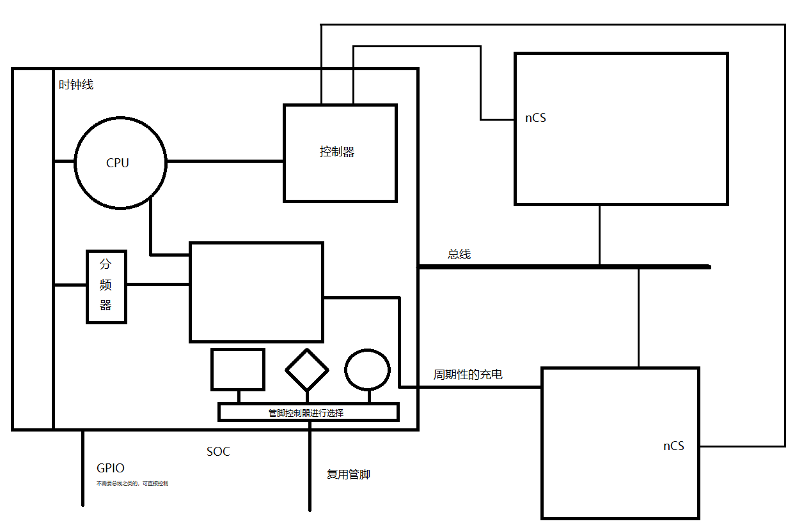

* 关闭看门狗、中断、MMU（在操作系统下才开始使用）、CACHE（数据cache）

* 配置系统工作时钟

  CPU的时钟一般比其他硬件的时钟快，所以其他硬件接入的时钟，一般是对接入的时钟进行分频后的时钟

* 配置SDRM的控制器（行地址数、列地址数、多少块、周期性的充电）

  >```c
  >int a[16];		%4bit表示：2^4
  >int b[4][4]; 	%2bit即可表示：2^2,先发出行坐标，再发出列坐标
  >```
  >
  >内存则使用三维空间进行寻址：面、行、列，硬件控制器实现控制，CPU把地址传给硬件控制器，硬件进行分维地址进行传送

+ 让sp指向可读可写的设备区间中，满足递减栈的规则 SDRM

  > 用哪些模式，就要初始化哪些模式下的sp
  >
  > 每个模式值不能覆盖其他模式

* 代码搬移，一般搬移到RAM上

  >执行速度问题，把程序从存储器（nor-flash）搬移到快速的内存
  >
  >只把存储器的一部分代码执行出来：对应存储器控制器的初始化，把存储在存储器位置上的代码搬移到内存

BL main

#### load的目的

执行应用逻辑（点灯、UART、Load Linux kernel...）

### 创建接口开发的工程

#### Makefile

1. 通用Makefile，支持SD卡启动和在uboot下直接运行在ram

   1. 程序运行时的地址

      DDR：0x20000000

      SD：0x0

   2. SD 16KB，需要加一个头信息，校验

      RAM不需要校验

2. 变量集合

   TARGET:DEP
   
   ​	COMMAND

```Makefile
#Design by Jqy
#define var
TARGET := len.bin #最终文件
BUILD := len.elf  #中间文件

ENV ?= RAM
SDTOOLS := ./mk210

COBJS += start.o #所需的.o文件
COBJS += main.o

CROSS_COMPILE := arm-linux- #交叉编译
CC := $(CROSS_COMPILE)gcc  #编译
LD := $(CROSS_COMPILE)ld   #链接
OBJCOPY := $(CROSS_COMPILE)objcopy  #文件格式转换

CFLAGS += -Wall   #所有警告打开
CFLAGS += -I./inc #增加头文件搜索路径

LDFLAGS += -Tmap.lds #-T后面直接跟链接脚本的名字
ifeq ($(ENV),RAM)
LDFLAGS += -Ttest=0x20000000 #链接选项，链接地址
else
LDFLAGS += -Ttext=0x0
endif

#Way
all:$(TARGET) #以all作为终极目标
ifeq ($(ENV),RAM)
$(TARGET):$(BUILD)
   $(OBJCOPY) -O binary $^ $@
else
$(TARGET):$(BUILD)
   $(OBJCOPY) -O binary $^ $@.temp
   $(SDTOOLS) $@.temp $@ #文件增加头
endif
$(BUILD):$(COBJS)
   $(LD) $(LDFLAGS) -o $@ $^
%.o:%.c
   $(CC) $(CFLAGS) -c -o $@ $^
%.o:%.S #.S后缀而不是.s后缀文件,.S文件可以使用C语言的预处理，不需要汇编的伪代码
   $(CC) $(CFLAGS) -c -o $@ $^
clean:
   rm -f $(TARGET) $(BUILD) *.temp *.o

```

4 条汇编代码---> 4B*4  = 16B

sdtools --->16K

#### 链接脚本

概念：告诉连接器如何工作的一个文本文件，即如何搭积木

要素：1. 哪一个.o文件放在代码段的起始位置 

2. 所有的.o放在哪个基地址：`ld -Ttest=xxxx` 让运行地址=链接地址
3. 代码段、数据段不连续，分别指定代码段和数据段的基地址

基本语法：SECTIONS

> .text：代码段	.rodata：只读数据段	.data：初始化数据段	.bss：未初始化数据段
>
> ALIGN：对齐方式

反汇编脚本：`arm-linux-objdump -d 加文件名`

## GPIO

General-purpose input/output

用汇编从零开始写一个Led点亮程序，并且从零写makefile文件，烧写来实验

汇编方式：

```assembly
.text
.global _start
_start:
   LDR R0,=0xE0200280
   MOV R1,#00000011
   STR R1,[R0]
   
   LDR R0,=0xE0200284
   MOV R1,#00
   STR R1,[R0]     
loop:
   B loop
```

```makefile
led_on.bin:led_on.S
	arm-linux-gcc -c -o len_on.o len_on.S
	arm-linux-ld -Ttest 0x20000000 -g led_on.o -o led_on.elf
	arm-linux-objcopy -O binary -S led_on.eif led_on.bin
clean:
	rm -f *.o *.eif *.bin
########################################################
led_on.bin:len_on.o
	arm-linux-gcc -c -o $^ len_on.S
	arm-linux-ld -Ttest 0x20000000 -g led_on.o -o led_on.elf
	arm-linux-objcopy -O binary -S led_on.eif led_on.bin	
%.o:%.S
	arm-linux-gcc -c -o $@ $<

clean:
	rm -f *.o *.eif *.bin
```

C语言加汇编方式：


```c
#define GPIOCON (*((volatile unsigned long *) 0xE0200280))
#define GPIODAT (*((volatile unsigned long *) 0xE0200284))
%volatile关键字是为了防止优化
int main(){
    GPIOCON = 0x00000011;
    GPIODAT = 0x00;
    
    return 0;
}
```

```assembly
.text
.gobal _start
.gobal _main
_start:
	BL main
	B loop
loop:
	B loop
```

```makefile
led_on.bin:led_on.S led_on.c
	arm-linux-gcc -c -o len_on.o len_on.S
	arm-linux-gcc -c -o len_on_c.o len_on.c
	arm-linux-ld -Ttest 0x20000000 -g led_on.o led_on_c.o -o led_on.eif
	arm-linux-objcopy -O binary -S led_on.elf led_on.bin
clear:
	rm -f *.o *.eif *.bin
###############################################
led_on.bin:begin.o main.o
	arm-linux-ld -Ttext 0x20000000 -g $^ -o led_on.eif
	arm-linux-objcopy -O binary -S led_on.elf led_on.bin
%.o:%.S
	arm-linux-gcc -c -o $@ $<
%.o:%.c
	arm-linux-gcc -c -o $@ $<
clear:
	rm -f *.o *.eif *.bin
```

$@：目标文件完整名称	$<：第一个依赖文件名称	$^：所有不重复依赖文件

$*：不含扩展名的目标文件

思路：

1. 建立`begin.S`-启动代码，运行c里面的main函数
2. 建立`main.c`-执行代码，GPIO操作
3. `Makefile`编写

## UART

Universal Asynchronous Receiver  and Transmitter：通用异步收发接口，是一种通用串行数据总线，用于异步通信。（异步串行全双工）

### 通讯的基本模型

1. 对象：不是软件，而是底层芯片与芯片之间数据传输的一个模型
2. 分类：
   * 全双工（既可以发又可以收）、单工（只能单纯的发或者收）、半双工（同时只能实现发和收的一种）
   * 串行、并行
   * 同步、异步（看有没有接入共同CLK线）

### UART协议介绍

能够解决数据的歧义性问题

* 电气规范：电压值的规范

  RS232C	1：(-12V)---(-15V)	0：(+12V)---(+15V)	电平转换芯片

* 人为的定义起始信号（下降沿），结束信号（上升沿），发送端和接收端约定发送数据的位数和奇偶校验位（奇偶校验位可有可无），停止位的位数，发送端和接收端的工作频率

### UART控制器介绍

目的：UART的硬件协议要求，通过软件去模拟该协议，是可行的，但是对于软件成本来说，非常不值，一般情况下，芯片公司会提供这种标准协议的控制器，软件工程师只需要告知控制器工作方式，然后就直接发送数据，控制器就可以把刚才的数据按照之前配置的工作模式，发送出去。

* 数据格式的控制：ULCON-->8bit、停止位、奇偶校验
* 整个UART控制器的控制：开关 UCON
* 配置波特率：UBRDIV、UDIVSLOT
* 数据收发缓存器：UTXH、URXH
* 数据收发状态

UART的整个流程可分为：UART INIT、数据的send和recv

## 中断控制器

### 中断的概念


PC、本身PC是顺序执行的，中断相当于打断PC运行的轨迹，将PC指向一个处理代码块，等待处理结束后，再恢复刚才被打断的PC的值，继续让PC运行。

* ARM中断方式
  1. 对应异常的入口地址
  2. 如何恢复现场

### 中断控制器的介绍


把多个中断源通过选择或者优先级比较，给CPU核心触发对应信号的一个工作；为了软件工程师可以知道这么多中断源，到底是哪个发生了请求，根据这个请求，做不同的事情。

分类：

1. 查询中断控制器

   查询中断控制器中保存了哪个中断号

   `int num = get_irq_num();`

   `switch(num){`

   `case 1:`

   ​       `XXXXXX`

   ​       `break;`

   `case 2:`

   ​       `YYYYYY`

   ​       `break;`

   `}`

   缺点：在中断源比较多的情况下，switch的效率不高

2. 向量中断控制器

   用硬件实现软件查找和软件中断向量表的功能

   `void (*a[10])(void);`

   `int i = 7;`

   `a[i]();`

### SPV210的中断控制器介绍

1. VIC0VECTADDR0 -- VIC0VECTADDR31

   向量中断控制器中硬件实现的向量表

2. VIC0VECPRIORITY0 -- VIC0VECPRIORITY31

   中断源的优先级寄存器

3. 控制器开关

   VIC0INTENABLE VIC0INTECLEAR

4. 状态寄存器

   VIC0IRQSTATUS VIC0FIQSTATUS

5. 中断处理函数地址存储器

   `a[i]`的值的存储

   VIC0ADDRESS

`init();` `key_handler();` `irq-->key_handler()`

具体外部如何触发中断的控制器：`EXT_INT_CON`、 `EXT_INT_MASK`（开关） `EXT_INT_PEND`（记录员）

总的中断控制器的配置

## I2C

Inter-integrated Circuit：内部整合电路，用在按键、显示、转换器、存储器、端口通讯、时钟日历、音频等等

**IIC总线**：半双工串行同步总线


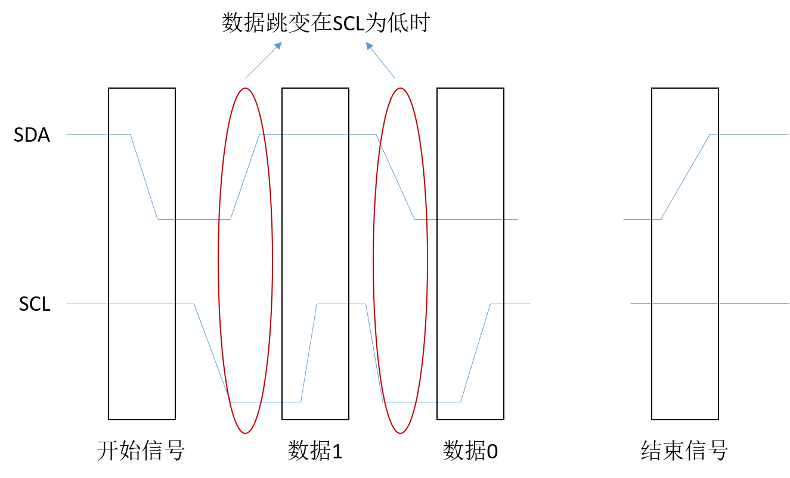

**IIC协议的介绍：**

1. 不是软件定义的协议，而是硬件规范
2. 起始、结束信号
3. 数据1和数据0，数据传递中，SCL为低电压时，SDA才能发生跳变，SCL为高电压时，SDA必须保持
4. 芯片识别：7bit的芯片地址

**IIC芯片地址的确定**

7 bit或者10bit，`Chipid + Varid`

## SPI

Serial Peripheral Interface ：串行外设接口，主要应用在EEPROM、FLASH、实时时钟、AD转换器，还有数字信号处理器和数字信号解码器之间

串行同步全双工总线，至少需要四根线：SDO（数据输出）、SDI（数据输入）、SCLK（时钟）、CS（片选）

以主从方式工作，

## PWM/WatchDog/RTC（三者都属于时钟）

PWM/WatchDog递减记时，RTC递增记时

**定时器概述：**芯片使用了一个叫递减计数器的功能块，每来一个时钟源，递减计数器减1，当减到0时，触发相应的输出引脚，发生跳变。

**watchdog：**需要在程序中喂狗

**RTC：**

* 实时时钟
* 2^15=32768Hz的晶振作为外部晶振，进行2……14的分频得到1Hz

**PWM：**脉冲宽度调制 

TCNT、TCNTB、TCMP、TCMPB

## ADC

**AD转换的原理：**模拟信号转换为数字信号的过程

## Flash ROM

## 项目

目的：搬移类似于bootloader的程序到内存

要求：通过我们自己的程序，把指定的`Nand-flash`里的内容，拷贝到片内的SRAM中。

设计到的知识点：

1. `Nand-flash`的驱动程序
2. 正常的工程代码，应该拷贝到片外的DRAM上，但是由于DRAM芯片结构比较复杂，程序设计起来相关数据非常多。直接使用芯片中的片内RAM。

意识：bootloader中代码初始化的过程

### `Nand-flash`的芯片结构

复用的数据管脚、功能选择管脚（命令、地址、数据）

命令发出格式

block、page、确当地址发出的方式

### `Nand-flash`的控制器

NFCONF、NFCONT、NFCMD、NFADDR、NFDATA、NFSTAT

### 操作函数

* 读取芯片的id号
* 读地址到内存


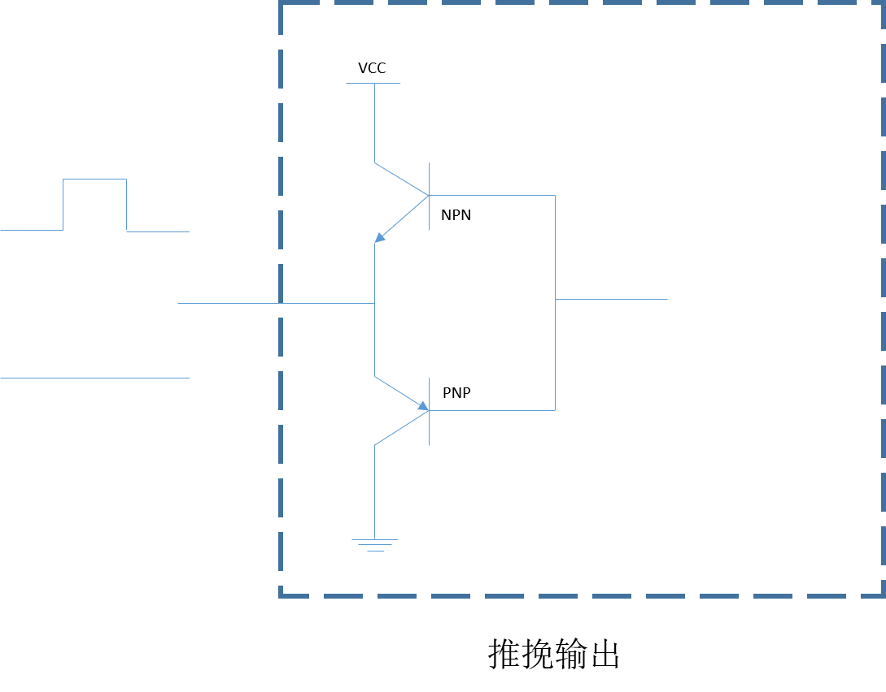

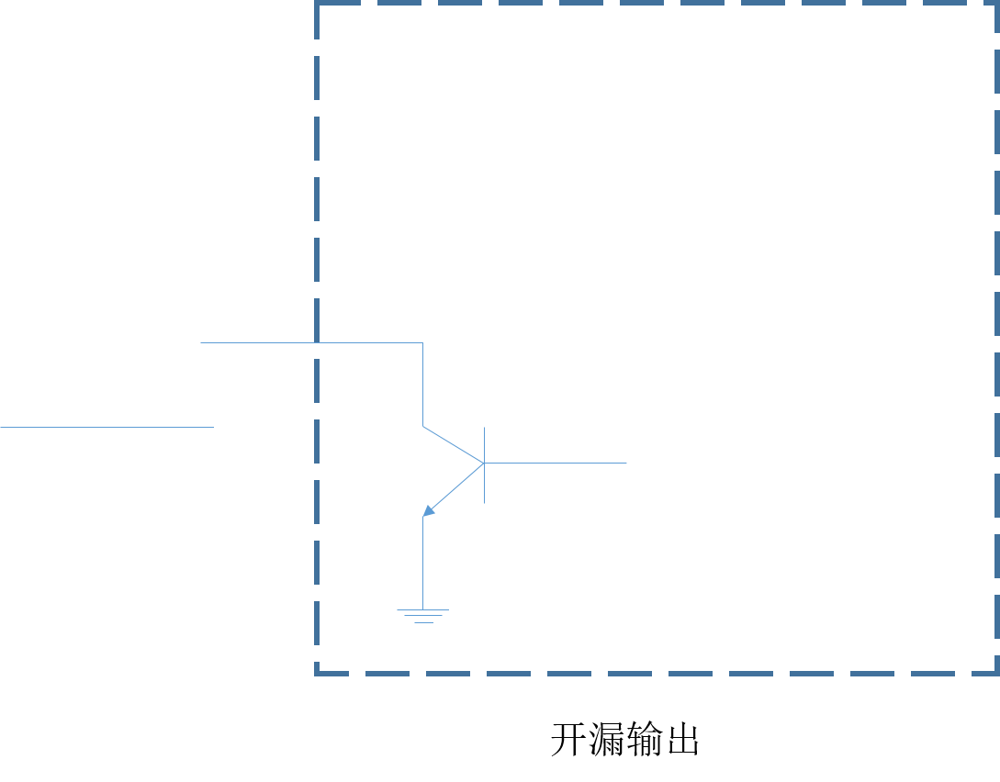

早期的芯片的IO引脚输出能力有限，所以一般需要引脚接上拉电阻