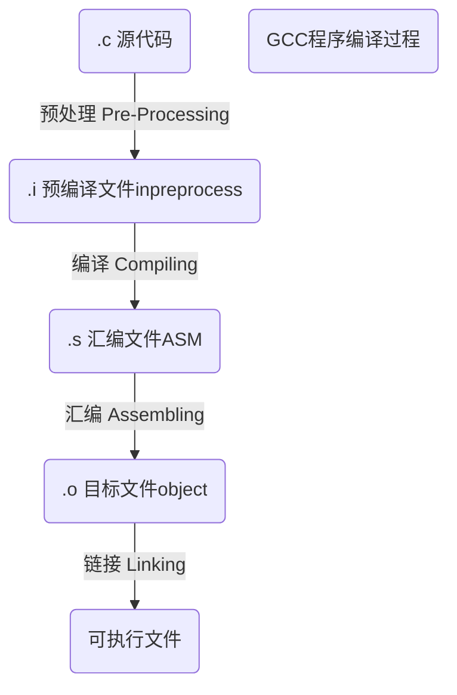

# 嵌入式学习1
## 工具的学习
### SSH（Secure Shell）的远程登陆
　　服务端使用sshd命
      （例如在要被访问的Linux机器上通过`sudo apt install openssh-server`安装sshd服务端程序）
　　客户端（client）SecureCRT实现SSH，通过ip密码登录

### Zmodem实现windows和Linux之间的文件传输
　　ubuntu （`rz`、`sz`命令） rz接受文件 sz发送文件，sz发送后面接文件名

### Samba服务实现Linux目录在windows上的映射
　　windows和windows之间通过晚上邻居的方式，实现文件共享(\\符号加地址)，windows和windows之间的协议为smb（send message block）；在s和b后面加a和windows上的协议相区别，__samba实现将Linux虚拟为一个假的windows，实现在远程windows上的共享，smbd、nmbd两个服务为Samba的服务进程。__

 　　samba需要添加用户的密码（`sudo smbpasswd -a 已有的用户名`），添加的用户必须为Linux系统已有的用户，密码需要重新设置，为了防止系统密码的泄露
服务的流程：

**安装服务->配置服务->重启服务**

```shell
sudo apt-get install samba ## 安装samba服务
vim /etc/samba/smb.cof ## 配置samba服务
sudo /etc/init.d/smbd restart 
sudo /etc/init.d/nmbd restart ## 重启samba服务
```

　　在window文件资源栏中输入`\\ip`即可，或者通过工具中的网络映射，把共享文件夹映射为一个盘符

配置例子：

```shell
[share]
    comment = Printer Drivers
    path = /xxx     #共享的目录
    browseable = yes
    writable = yes
```

***

## 程序的学习

### GCC的使用及其常用选项介绍

C语言如何变成机器指令

gcc工具常用选项的意义

#### Gcc的概述

最初的全名GNU C Compiler

随着支持语言的增加，变为GNU Compiler Collection

翻译官：人能理解的语言翻译为机器识别的语言

#### C的编译过程

文件后缀名c、cpp等，gcc通过后缀名，调用不同的编译器

gcc -o 输出的文件名 输入文件名

gcc -v -o 输出文件名  输入文件名 (-v打印编译的信息) 打印出来内容空格之后的内容为调用的文件

gcc -S -o 编译为.s文件（编译器）生成汇编命令文件

gcc -c -o 编译为.o文件（汇编器）生成二进制文件

gcc -o （链接各种.o文件）生成最终的执行程序

| 编译过程中的参数 |                   功能                   |
| :--------------: | :--------------------------------------: |
|        -E        |          只是预编译，生成.i文件          |
|        -S        |        编译器编译，生成.s汇编代码        |
|        -c        |        汇编器编译，生成.o目标文件        |
|        -o        | 链接生成的各种.o文件，生成最后的执行文件 |
|     -o file      |             指定目录输出文件             |
|     -I[dir]      |              搜索头文件路径              |
|        -g        |                  debug                   |

##### 预处理

【cpp -o 生成预处理文件(替换)】

gcc -E -o 生成.i文件

define和include这两个不是关键字，因为预处理时已经处理了define和include，所以编译时已经不存在define和include的，因此编译的过程就是编译关键字及运算符号

##### 常见错误

include出错，include双引号引用的一般是自己自定义的库寻找当前目录，<>为查找系统库函数

not found的解决：gcc -I跟查找头文件的目录 -o

###### 链接出错

原材料不够：undefined，寻找标签是否实现，链接时是否加入

或者多了：multiple definition，多次实现了标签，只保留一个标签实现

##### 预处理器的使用

#inlude 包含头文件，预处理器将头文件展开

#define  宏  替换 不进行语法检查

>#define 宏名  宏体  （加括号）
>
>#define ABC  5+3      printf("The number of the %d\n", ABC*5)   5+3\*5 不加括号可能与预计结果不同
>
>#define ABC(x) (5+(x))   宏定义的函数

#ifdef #else #endif  条件编译，有利于debug和release版本之间的互换

gcc -D

>gcc -DABC === #define ABC

预定义宏

```c
__FUNCTION__:函数名%s
__LINE__：行号%d
__FILE__：文件名%s//方便调试
```

宏展开下的#、##

`#` 字符串化

`##` 链接符号

```c
#define ABC(x) #x//进行字符串化"x"，输出字符串x
#define ABC(x) day##x//进行链接day和x，输出为dayx
```



首先进行预处理，其次进行编译，再进行汇编，最后进行链接。预处理的作用主要包括源代码中的头文件展开、宏定义的替换和处理条件编译指令等，生成.i后缀的文件；编译的主要作用是处理源代码中的关键字及运算符号等，将其翻译为汇编代码，生成.s后缀的汇编代码，期间还会对目标代码进行一定的优化；汇编器的主要作用是将上一步生成的汇编代码转换为目标机器可以识别的指令，生成对应.o后缀的文件；最后的链接将生成的各种.o文件进行链接，生成最终的可执行文件；其中链接的过程又分为静态库的链接和动态库的链接两种，静态库的链接相当于将库文件和源代码一起打包，使得可执行程序移植方便，但是对程序的更新和部署会带来不便，并且最终生成的文件也较大，与之相对，动态库在链接的过程中不会将库文件进行打包，只是在可执行文件运行的过程才载入需要的库文件，从而使得程序的更新变得简单，最后生成可执行文件也相对较小。

|      后缀名       |           对应的语言           |
| :---------------: | :----------------------------: |
|        .c         |           C原始程序            |
|    .C/.cc/cxx     |          C++原始程序           |
|        .m         |      Objective-C原始程序       |
|        .i         |     已经预处理的C原始程序      |
|        .ii        |    已经预处理的C++原始程序     |
|       .s/.S       |        汇编语言原始程序        |
|        .h         |      预处理文件（头文件）      |
|        .o         |            目标文件            |
| .a（archive）/.so | 编译后的库文件，静态库和动态库 |

##### 库选项

linux下静态链接库和动态链接库格式

.a [libname.a]	静态连接库

.so [libname.so[主版本号.次版本号码.发行号]]	动态链接库

|  命令   |                             功能                             |
| :-----: | :----------------------------------------------------------: |
| -static |                           静态编译                           |
| -shared |               1.生成动态库文件 2.进行动态编译                |
| -L dir  |                     库文件搜索中添加路径                     |
|  -fPIC  | 生成使用相对位置无关的目标代码（Position Independent Code），然后通常用于使用gcc的-static选项，从该PIC目标文件生成动态库文件 |

**C语言在编译过程中，动态链接库和静态链接库编译的最大不同实在链接的环节**

###### 编译静态链接库和动态链接库

编译静态链接库

1. 先生成目标文件.o
2. `ar crv[*.a][*.o]`

调用静态链接库`gcc -o [file] [file.c] -L`

编译动态链接库

1. 生成位置无关的目标代码 `gcc -fPIC -c [*.c]`
2. `gcc -shared -o [*.so][*.o]`

调用动态链接库`gcc -o [file] [file.c] -L`

关于动态链接库的系统路径PATH

##### 警告选项

|   命令    |            功能             |
| :-------: | :-------------------------: |
|    -w     |        关闭所有警告         |
|   -Wall   | 发出gcc提供的所有有用的警告 |
| -pedantic |    发出ansi c的所有警告     |

##### Debug

gdb+编译好的程序（进入gdb后，输入wi会有字符界面显示，方便查看）

|                     命令                     |    功能    |
| :------------------------------------------: | :--------: |
|                    l(ist)                    | 显示源代码 |
| b(reak) 函数名/行号/文件名:行号/行号 if 条件 |   打断点   |
|                i(nfo) b(reak)                |  查看断点  |
|              d(elete) 断点编号               |  删除断点  |
|           r(un) c(ontinue) q(uit)            |    运行    |
|            n(ext) s(tep) f(inish)            |  单步调试  |
|                  p(rint) 值                  |   打印值   |
|                   watch 值                   |   监控值   |

##### Make程序

作用：1.工程文件组织，编译成复杂的程序 2.安装及卸载程序

在shell中运行make指令时，make指令在当前文件夹下依次查找下列文件：`GNUMakefile->makefile->Makefile`

Makefile由若干条规则构成，每个规则如下：

```c
targets(目标):prerequisites(依赖)
    command(命令)
```

Make的编写规则：

makefile变量：

1. 用户自定义变量
2. 预定义变量
3. 自动变量及环境变量

| 自动变量及环境变量 |               功能               |
| :----------------: | :------------------------------: |
|         $*         |    不包含扩展名的目标文件名称    |
|         $<         |        第一个依赖文件名称        |
|         $?         | 所有时间戳比目标文件晚的依赖文件 |
|       **$@**       |       **目标文件完整名称**       |
|       **$^**       |     **所有不重复的依赖文件**     |

make工作流程

1. 首先make会在当前目录下找到名字为“Makefile”或者“makefile”的文件；
2. 如果找到，它会找文件中的第一个目标文件（target）并把这个文件作为最终的目标文件；
3. 根据时间戳生成目标文件；
4. 递归去寻找目标文件依赖文件，并且递归生成（同样有时间戳问题）

makefile规则：

1. 显式规则

2. 隐式规则

   在规则中没有找到需要的.o文件时，不需要自己编写生成.o文件的命令，会自动寻找当前文件夹下同名的.c文件，生成所需要的.o文件。

伪目标：没有依赖关系，也不会生成文件，防止当前文件夹下出现一个clean的文件，使用`make clean`出现歧义

```makefile
.PHONY: clean
clean:
	rm
#命令前面加@符号可以屏蔽信息的输出
all: prog1 prog2 prog3
.PHONY: all
prog1:prog1.o utils.o
	cc -o prog1 prog1.o utils.o
prog2:prog2.o
	cc -o prog2 prog2.o
prog3:prog3.o sort1.o utils.o
	cc -o prog3 prog3.o sort1.o utils.o
#用伪目标生成多个文件
```

引用其他makefile及makefile嵌套

```makefile
include proc/makefile#包含
#嵌套
subsystem:
	cd subdir && gcc -c main.c
#subsystem:
#	gcc -c main.c -C subdir
#上下两个subsystem命令等价  嵌套
```

条件判断

使用函数

makefile管理命令

|  命令   |                功能                |
| :-----: | :--------------------------------: |
| -C dir  |      读入指定目录下的makefile      |
| -f file | 读入当前目录下的file文件为makefile |
|   -i    |        忽略所有命令执行错误        |
| -I dir  |    指定被包含的makefile所在目录    |

##### AutoTools

用来自动生成Makefile（可以在Gnu官网搜索Autoconf）

Files used in preparing a software package for distribution, when using just Autoconf:

```
     your source files --> [autoscan*] --> [configure.scan] --> configure.ac
     
     configure.ac --.
                    |   .------> autoconf* -----> configure
     [aclocal.m4] --+---+
                    |   `-----> [autoheader*] --> [config.h.in]
     [acsite.m4] ---'
     
     Makefile.in
```

Additionally, if you use Automake, the following additional productions come into play:

```
     [acinclude.m4] --.
                      |
     [local macros] --+--> aclocal* --> aclocal.m4
                      |
     configure.ac ----'
     
     configure.ac --.
                    +--> automake* --> Makefile.in
     Makefile.am ---'
```

Files used in configuring a software package:

```
                            .-------------> [config.cache]
     configure* ------------+-------------> config.log
                            |
     [config.h.in] -.       v            .-> [config.h] -.
                    +--> config.status* -+               +--> make*
     Makefile.in ---'                    `-> Makefile ---'
```

完整的命令：

```shell
autoscan
mv configure.scan configure.ac
##编辑配置configure.ac，配置输出等
vi configure.ac##添加AM_INIT_AUTOMAKE(输出文件名，版本号)的AC的宏
aclocal#展开宏
autoconf
autoheader
##配置Makefile.am
automake --add-missing
./configure##生成Makefile文件
make dist##将程序打包
```


### C语言常用关键字及运算符操作

什么时候用？
怎么用？
为什么要这样设计？

#### 关键字（32个关键字）

编译器**预定义了一定意义的**字符串

sizeof：编译器给我们查看内存空间容量的一个工具（不存在具体函数，裸板也可以实现）

return：返回的概念

##### 数据类型关键字：

C操作对象：资源/内存（内存类型的类型，LCD缓存、LED灯等）

C语言如何描述这些资源的属性：资源属性大小（使用数据类型关键字），限制内存（土地）的大小，关键字

char、int、long、short、         unsigned、signed、       float、double、         void

char：面向硬件，硬件芯片操作的最小单位bit（位），软件操作的最小操作单位B（字节），1B==8bit，硬件处理的最小单位

ASCII码表 8bit==256

int：根据编译器来决定，编译器最优的处理大小，系统一个周期所能接受的最大处理单位

32bit 4B int    16bit 2B int

整型常量，char a = 300，在超出数据容量的时候，在数字常量后面加L

无符号（数据），有符号（数字）：内存空间的最高字节，是符号位还是数据 

0x10  16

0001 0000 16

float  4B  

double 8B

浮点型常量：默认是double，在数字后面加f可以分配为float大小

void申明标志，语义意义，不申请实际的内存大小

##### 自定义数据类型关键字：

struct、union、enum、typedef（别名）

C编译器默认定义的内存分配不符合实际资源的形式

struct：元素之间的集合，顺序有要求

union（共用体）：共用起始地址分享地址空间，技巧型的代码

enum：枚举（enumerate），被命名的整型常数的集合，语义意义，主要是便于人与人之间交流，实际大小只表示一个整型int

```c
#define MON 1
#define TUE 2
#define WED 3

enum day{
    MON,
    TUE,
    WED
};
//前后两种定义方式都是一样的效果，使用的时候，也都可以直接访问
```

typedef：数据类型的别名

```c
int a; //a是一个int类型的变量
typedef int a_t //a_t是一个int类型的外号
```

##### 逻辑结构关键字：

CPU顺序执行程序

分支-》选择

循环

if、else

switch、case、default

```c
switch(整型数字):
case A:
	break;
case B:
	break;
default:
```

do、while、for

for：次数

while：条件

countinue、break、goto

##### 类型修饰符

auto、register、static、const、extern、volatile

对内存资源存放位置的限定

auto（默认情况）：自动内存，可读可写空间；如果在{}内定义，为栈空间

register：寄存器内存，定义一些快速访问变量；编译器会尽量的安排CPU的寄存器去存放定义的变量，如果存储器不足时，变量还是存放在存储器中；&对register不起作用

static：静态，修饰3种数据

> 函数内部的变量
>
> 函数外部的变量
>
> 函数的修饰符

const：常量的定义，只读的变量

extern：外部声明

volatile：告知编译器编译方法的关键字，不优化编译，修饰变量的值的修改，不仅仅可以通过软件，也可以通过其他方式（硬件等）

内存泄漏

#### 运算符

##### 算数操作运算

+、-；*、/、%取余（取一个范围的数）

n % m =得出的数的范围为[0,m-1]

用法1. 给一个任意的数字，得到一个1到100以内的数字

(m%100)+1

用法2. 得到一个m进制的一个个位数

用法3. 循环数据结构的下标

##### 逻辑运算

0：假  1：真   非零值为非假

```c
A || B != B || A//前后两种表达式不等
A && B != B && A
    
int a = 10;
res = ((a == 10) || printf("==========\n"));
//输出：
//The value of the res:1
res = (printf("==========\n") || (a == 10));
//输出：
//=========
//The value of the res:1
printf("The value of the res:%d\n", res);

!//取反，真取反为假
   ~ //对比位运算中的取反
```

##### 位运算

移位符号

**左移**：乘法*2 二进制下的移位

```c
m<<1 == m*2; m<<n == m*2^n
unsigned int a = b * 32;//等价于 b << 5
```

4：00100

8：01000

数据、数字

```c
//-1在8bit中的表示
//1 0 0 0  0 0 0 1             1 0 0 0  0 0 1 0 最高位为符号位
//1 1 1 1  1 1 1 0             1 1 1 1  1 1 0 1 补码
//1 1 1 1  1 1 1 1 ===== -1    1 1 1 1  1 1 1 0 ===== -2
//所以左移的情况下，负数也遵循上面的说法
```

**右移**：数以2，二进制下的移位

```c
m>>n == m/(2^n)
```

与符号变量有关

如果是正数，最高位表示符号位，为0，在不断右移的过程中会最终达到二进制中的所有位位0（因为右移左补0）

如果是服饰，最高位表示符号位，位1，在不断右移的过程中不会达到二进制中的所有位位0，会达到所有位为1的结果（因为右移左补1）

&、|、^

```c
&：
int a = 0x1234;
a & 0xff00;//屏蔽低八位，取出高八位 &屏蔽 
//&取出 A & 1 ---> A
//&：清零器 A & 0 ---> 0
|:
//保留 A | 0 ---> A
//|：设置器，A | 1 ---> 1 全部设置为高电平的方法

//设置一个资源的bit5为高电平，其他不变
int a;
a = (a | (0x1<<5));------a=(a | (0x1<<n));//对第n位置为1
//清除一个资源的bit5
int a;
a = (a & ~(0x1<<5));------a=(a & ~(0x1<<n));//对第n位清零
//^（异或）:
//算法
int fun()
{
    int a = 10;
    int b = 20;
    
    a = a ^ b;
    b = a ^ b;
    a = a ^ b;//最后的a和b实现了互换
}
//~:(逐位取反)
```

##### 赋值运算

=、+=、-=

##### 内存访问符号

```c
//():限制符（运算优先）、函数访问符号
//[]:数组（内存访问的ID符号）
//{}:函数体的限制符
//->
//&、*
```

#### C语言内存空间的使用

##### 指针概述

内存类型资源地址、门牌号的代名词，指针指向内存空间，一定要保证合法性

指针变量：存放指针这个概念的盒子

C语言编译器对指针这个特殊的概念，有2个疑问？

1. 分配一个盒子，盒子要多大，

   在32bit系统中，指针存储的大小就是4个字节

2. 盒子里存放的地址，所指向内存的读取方法是什么

   char *p//相当于一次存取内存范围的大小;一次读取1个字节

   int *p//p一次读取4个字节

   ```c
   #include<stdio.h>
   
   int main(){
       int a = 0x5678;
       unsigned char *p;
       
       p = &a;//不管是大端还是小端，都是最小的地址赋给指针
       
       printf("The value of the p: %x", *p);
       //输出为78
       //因为char一次只能读取一个字节8bit的大小，而a有16bit
       return 0;
   }
   ```

   

`2^10:1KB 2^20:1MB 2^30:1GB 2^32:4GB`

32位系统最多只能支持4G，`2^30个8bit的盒子也就是1GB，其中的指数的30个二进制数存储以位为单位`

寻址只能到Byte，寻不到bit，所以一个地址单元就是1Byte=8bit

##### 指针+修饰符

const：常量、只读 左数右指

内存属性：内存操作的大小（使用char、int等）、内存的变化性（可读可写）

>char *p
>
>const char *p等价于char const *p//p为指针变量，为只读指针，指向的内容不希望修改
>
>char * const p等价于char *p const//p指向的地址不能再变，指向的内容可以变，一般为**硬件资源**的定义
>
>const char * const p//p指向的地址和地址内的内容都不能变       类似ROM

```c
#include<stdio.h>

int main(){
    char *p = "hello world\n";//正确的为const char *p = "hello world\n"
    char buf[] = {"hello world\n"};//数组可以被修改
    char *p2 = buf;
    //*p = 'a';会产生段错误，char *p为指针变量，字符串"hello world\n"为字符串常量，字符串常量不能被修改，虽然指针常量能够被修改，但是字符串常量不能够被修改，本身char *p = "hello world\n"语句就是一个错误，一个能够修改的变量指向了不能被修改的字符串地址
    printf("The one is %x\n", *p);
    *p2 = 'a';
    printf("The %s\n", p);//输出The aello world
}
```

volatile：防止优化指向内存地址，和硬件有关

>volatile char *p

typedef：别名

```c
char *name_t;
typedef char *name_t;
name_t abs;//等价于第一行的声明
```

##### 指针+运算符

++、--、+、-：

指针的加法或者减法运算，实际上加或者减的是一个单位，单位的大小为sizeof(p[0])

```c
int *p p+1//p没有改变
char *p p+1//两个结果不同
p++、p-- //更新地址
```

[]：

变量名[n]   n：ID、标签

地址内容的标签访问方式，取出标签里的内存值，非线性访问，跳越性访问

`p+n访问的是地址，p[n]访问的是内容`

变量是从高地址往低地址分配

```c
#include<stdio.h>

int main(){
	int a = 0x12345678;
    int b = 0x99991199;
    int *p1 = &b;
    char *p2 = (char *)&b;
    printf("The p1+1 is %x,%x,%x\n", *(p1+1), p1[1], *p1+1);
    printf("The p2+1 is %x\n", p2[1]);//输出11
}
```

内存越界

```c
#inlcude<stdio.h>
int main(){
	const int a = 0x5678;
    int b = 0x1234;
    int *p = &b;
    //a = 100;//报错，const a告知编译器，a不能变动
    p[1] = 0x100;//等价于*(p+1) = 0x100;将const a给强行改变了
    printf("The a is %x\n",a);
    return 0;
}
```

逻辑操作符

`>= <= == !=`

`== !=:`

```c
int *p1;
int *p2;
p1 > p2;
*p1 > *p2;
```


1. 跟一个特殊值进行比较  0x0：地址的无效值，结束标志

```c
if(p == 0x0)
NULL
```

2. 指针必须是同种类型的比较才有意义（编译过程中检查）

   char* int*

##### 多级指针

存放地址的地址空间，表述的一种关系性（让本来不连续的空间以连续的指针进行表示）

`int **p` 第一个int修饰第一个`*`，`*p`的大小为4字节，p[m] == NULL ---->结束

```c
int main(int argc, char **argv){
    for(int i = 0; i < argv; i++){
        printf("The argv[%d] is %s/n", i, argv[i]);
    }
    
    return 0;
}

int main(){
    int i = 0;
    while(argv[i] != NULL){
        printf("The argv is %s\n", argv[i]);
        i++;
    }
    
    return 0;
}
```

##### 数组

内存分配的一种形式

数组的定义及初始化

定义一个空间：1、大小 2、读取方式

数据类型 数组名[m] m的作用域只在申请的时候起作用

数组名是一个**常量**符号，一定不要放在=的左边

```c
char buf[100];
buf = "Hello world";//数组名（便签）不能放在等号左边，错误
```

越界

数组空间的初始化

按照标签**逐一处理**

程序员为了减少工作量，空间定义时，就告知编译器的初始化情况，空间的第一次赋值，初始化操作

C语言本身，CPU内部本身一般不支持空间和空间的拷贝

```c
int a[3] = {1,2,3};//实际就是a[0] = 1、a[1] = 2、a[2] = 3的操作

char buf[] = {'a','b','c'};
//buf当成普通内存来看，没有问题
//buf当成一个字符串来看，最后加上一个'\0'，字符串的重要性，结尾一定有个'\0'
char buf[] = {"abc"};//这种方式的化，程序会自动给结尾加上'\0'
char buf[] = "abc";//"abc"为常量，不能变，buf为变量，将常量一个一个拷贝到buf中，可以修改buf中的内容，但是"abc"常量本身不会变

```

**数组的初始化和变量的初始化本质不同**，尤其再嵌入式的裸机开发中，空间的初始化往往需要库函数的辅助

第二次内存初始化，逐一赋值

一块空间，当成字符空间，提供了一套字符拷贝函数

字符拷贝函数的原则：内存空间和内存空间的逐一赋值的功能的一个封装体，一旦空间中出现了0这个特殊值，函数就即将结束。

`strcpy()会出现内存泄漏`、`strncpy拷贝字符串更加安全`，这两个用来专门拷贝字符串，拷贝数据的化，会不安全，因为这两个函数遇到0会结束，然而数据中可能刚开始就出现0

非字符串空间

字符空间：可以用ASCII码编码来解码的空间--->给人看

非字符空间：数据采集，开辟一个存储这些数据的盒子，拷贝三要素：src、dest、个数，拷贝数据可以使用函数`memcpy`

```c
char buf[10];---->string
unsigned char buf[10];---->data
    
int buf[10];
int sensor_buf[100];
memcpy(buf,sensor_buf,10*sizeof(int));//第三个参数的单位为Byte，如果没有乘以sizeof(int)，则只拷贝了10个字节，但是int buf中一个数4个字节（int的大小）,先要拷贝里面的是个数，就必须乘以sizeof(int)
```

指针与数组

指针数组与二维指针类似

数组名的保存

定义一个指针，指向`int a[10]`的首地址

定义一个指针，指向`int b[5][6]`的首地址

**C语言编译器就是一个字符串解释器，从右往左读**

```c
int *p[3];//C语言从右往左读，p成为数组的便签
int (*p)[3];//先读括号，p先为指针，3个int一起读

int a[2][3][4];//两面，3行4列
int (*p)[3][4] = a;
```

##### 结构体

字节对齐：效率，牺牲一点空间换取时间的效率；最终结构体的大小是4的倍数（32位系统）；结构体里面变量的顺序不一致，也会影响到它的大小

位域

##### 内存分布图

内存的属性：大小、在哪里

默认方式再哪里

编译->汇编->链接

```c
内核空间 应用程序不允许访问
--------------------bb   3G
栈空间：局部变量 读写  临时存储，运行时才出现
------bb bb之间的内容，函数消失，即消失
运行时的堆空间地址：malloc
------zz
全局的数据空间（初始化的空间DATA、未初始化的空间BSS）static 读写
只读数据段 "hello world"（字符串常量） 只读   TEXT
代码段：code 只读   TEXT
------zz  zz之间在程序运行之前已有，整个程序消失才消失
系统保留空间 应用程序不允许访问
------
0x0
```

size+生成的程序：显示程序各段的大小        strings+生成的程序：显示程序中的字符串    nm+生成的程序：第一列为地址，第二列为标记，第三列为标签

text：代码段 

data：数据段 

bss：未初始的数据段

**单引号是数，双引号是空间**

const int为只读变量，然而，通过其定义的值，还可以通过指针指向该值，然后改变其值的方式改变它的值

栈空间：运行时才有，函数内部使用的变量，函数一旦返回就释放，生存周期是函数内

堆空间：运行时才有，可以自由，自我管理的分配和释放的空间，生存周期是由程序员来决定  

> 分配：malloc()，一旦成功，返回分配好的地址给我们，只需要接受，对于这个新地址的读法，由程序员灵活把握，输入参数指定分配的大小，单位就是B
>
> 释放：free(p)

```c
char *p;
p = (char *)malloc(100);
if (p == NULL){
    error;
}

free(p);//一定要释放，不然会出现内存泄露

int a[5];
malloc(5*sizeof(int));
```

只读空间：静态空间，编译时确定，整个程序结束时释放内存，生存周期最长

#### C语言函数使用

##### 函数概述

一堆代码的集合，用一个标签去描述它

复用化

标签----->函数名

函数：函数具备3要素1.函数名(地址) 2. 输入参数 3.返回值

在定义函数时，必须将3要素告知编译器

如何让用指针保存函数：

`int (*p)(int, int, char)`函数指针

定义函数、调用函数

**标签就是地址**

```c
#include<stdio.h>
int main(){
    int (*myshow)(const char *,...);
    printf("Hello world!\n");
    myshow = printf;
    //把数转化成地址，只不过这个地址时按照函数读法读，强制转换
    //myshow = (int (*)(const char *,...)) 0x8048320;
    //0x8048320为printf函数在具体程序中的地址
    myshow("============\n");//myshow实现和printf一样的功能
    return 0;
}


int (*p[7])(int, int);//注册，将函数的地址放在数组中
p[0]=fun1;
p[1]=fun2;......
p[day](10,20)//回调，直接调用函数，传递参数
```

##### 输入参数

承上启下的功能

调用者：函数名（要传递的数据：实参）

被调者：函数的具体实现，函数的三要素，（接收数据的参数为：形参）

实参传递给形参，传递的形式：**拷贝**

值传递：上层调用者保护自己空间值不被修改的能力

地址传递：调用者让下层子函数修改自己空间值的方式

>地址传递的作用：
>
>1. 修改       int short long只是**一个值的修改**
>
>2. 空间传递
>   1. 子函数看看空间里的情况   const
>   2. 子函数反向修改上层**空间里的内容**   char(字符空间)  void(非字符空间)
>
>空间：空间首地址、结束标志
>
>字符空间：内存里面存放了0x00（1B），字符空间
>
>```c
>int strlen(const char *p){
>    /*错误处理，判断输入参数是否合法*/
>    if (p == NULL){
>        ......
>    }
>    /*内存处理，从头到尾逐一处理*/
>    while(p[i] != 0){
>        ......
>        i++;
>    }
>}
>
>""--->初始化const char*//""定义的是常量
>char buf[10]--->初始化char*
>    
>//char *：字符空间的标识符
>```
>
>非字符空间：非字符空间0x00，不能当成结束的标志
>
>```C
>unsigned char *p;//结束标志：数量(B)
>void fun(unsigned char *p, int len){
>    for(int i = 0; i < len; i++){
>        ......;
>    }
>}
>
>int main(){
>    struct sensor_data buf;
>    
>    fun(&buf, sizeof(buf)*1);
>}
>
>//void *:数据空间的标识符
>//大小
>//memcpy的函数声明
>int fun(void *buf, int len){
>    unsigned char *tmp = (unsigned char *)buf;//转换为具体类型
>    tmp[i];
>    i++;
>}
>```

连续空间的传递：类似结构体这样的连续空间，用指针方式较好

> 数组名--标签
>
> int abc[10];
>
> 实参：
>
> fun(abc)
>
> 形参：
>
> void fun(int *p)//与void fun(int p[10])同样的效果

> 结构体变量
>
> struct abc{....};
>
> struct abc buf;
>
> 实参：
>
> fun(buf)
>
> fun(&buf)
>
> 形参：
>
> void fun(struct abs a1)
>
> void fun(struct abc *a2)
>
> >第一种方式消耗内存，用第二种方式（指针方式）节约空间

空间的读写问题

const char *p：只读空间，只是看看

char *p：该空间可能修改

void fun(const char *p);

```c
int a = 12;
char buf[10];
printf("%d", a);
sprintf(buf,"%d",a);//可以实现格式转换的存储，将int a转换为字符串的a，并保存在buf中
```

##### 返回值

提供启下功能的一种表现形式

返回类型：基本数据类型、指针类型（空间）

返回基本数据类型：

```c
void fun2(int **p){
    ...;
}

int main(){
    int *p;
    fun2(&p);
}
```

`把int *p写成int* p，p是一个变量，它的类型是int*，这就相当于int a一样了`

**返回连续空间类型：指针作为空间返回的唯一数据类型**（就是函数返回为*，例如`char *` `int *`等）

地址：指向的合法性；作为函数的设计者，必须保证函数返回的地址所指向的空间是合法（不是局部变量）。

```c
#include<stdio.h>
char *fun(void){
    return "hello world";//""定义了字符串常量，return回来的是字符常量的地址
}
int main(){
    char *p;
    p = fun();
    printf("The p is %s/n", p);
    return 0;
}
```

函数内部实现：

>1.静态区 static（被调函数内部的局部变量，加上static，该变量将被存放在静态区，就可以被被调函数通过return返回）
>
>2.只读区：字符串常量（不太常用）
>
>3.堆区 malloc free
>
>```c
>#include<stdio.h>
>#include<stdlib.h>
>#include<string.h>
>
>char *fun(void){
>    char *s = (char *)malloc(100);
>    strcpy(s,"hello world");
>    return s;
>}
>int main(){
>    char *p;
>    p = fun();
>    printf("The p is %s\n", p);
>    free(p);
>    return 0;
>}
>```

#### 常见面试题目

##### 嵌入式工程师0x10

###### 宏定义

1.用预处理指令`#define`声明一个常数，用以表示1年中有多少秒（忽略闰年问题）

`#define 宏名 宏体 `

宏名：大写字母表示`#define SECOND_OF_YEAR (365*24*3600)UL` L:long 最少4个字节

int的常量：在不同的系统上代表的字节大小不一样

8bit:0-255 256

16bit:0-65535 65536

###### 数据声明

用变量a给出下面的定义（**数据的声明：以变量名为中心节点，先向右看（看到方括号升级为数组，看到圆括号升级为函数名）再向左看**）

1. 一个整型数（an interger）`int a`
2. 一个指向整型数的指针（a pointer to an interger）`int *a`
3. 一个指向指针的指针，它指向的指针是指向一个整型数（a pointer to pointer to an interger）`int* *a`
4. 一个有10个整型数的数组（an array of 10 integers）`int a[10]`
5. 一个有10个指针的**数组**，该指针指向一个整型数的（an array of 10 pointers to intergers）`int* a[10]`
6. 一个指向有10个整型数数组的**指针**（a pointer to an array of 10 integers）`int [10] *a ---> int (*a)[10]`（一块一块的读）
7. 一个指向函数的**指针**，该函数有一个整型参数并返回一个整型数（a pointer to a function that takes an integer as argument and returns an integer）`int (*a)(int)`
8. 一个有10个指针的**数组**，该指针指向一个函数，该函数有一个整型参数并返回一个整型数（an array of ten pointers to functions that take an integer argument and return an integer）`int (*a[10])(int)`

###### 修饰符的使用总结

关键字static的作用是什么？

1. 修饰局部变量 

   >默认局部变量在栈空间存放，生存期比较短
   >
   >局部静态化，局部变量在静态数据段保存，生存期非常长

2. 修饰全局变量 

   >防止重命名，限制变量名只在本文件内起作用

3. 修饰全局函数

   >防止重命名，限制该函数只在本文件内起作用

关键字const有什么含义？

C：只读，建议性 不具备强制性 !=常量

C++：常量

关键字volatile有什么含义？并给出三个不同的例子

防止C语言编译器优化

>修饰的变量，该变量的修改可能通过第三方来修改
>
>寄存器、中断、多线程

###### 位操作

嵌入式系统总是要用户对变量或寄存器进行位操作。给定一个整型变量a，写两段代码，第一个设置a的bit3（置1），第二个清除a的bit3（清0）。在以上两个操作中，要保持其它位不变。

```c
unsigned int a;
a |= (0x1<3);
a &= ~(0x1<<3);
```

###### 访问固定内存位置

在某工程中，要求设置一绝对地址为0x67a9的整型变量的值为0xaa66。编译器是一个纯粹的ANSI编译器，写代码去完成这一任务。

```c
int *p = (int *)0x67a9;
p[0] = 0xaa66;//*p = 0xaa66

*((int *)0x67a9) = 0xaa66;

((void (*)(void))0x67a9)();
```

## Linux

### shell

不同shell，命令解释不一样

sh：Bourne shell，ksh：Korn shell，csh：Cshell，bash：Bourne-again shell，tcsh

### 命令提示符

不同shell的命令提示符不一样

sh，bash：#root	$user

csh：#root	%user

### 文件系统分类

磁盘文件系统：NTFS、EXT3

闪存文件系统：JFFS2、YAFFS

数据库文件系统：BFFS、WINFS

网络文件系统：NFS

虚拟文件系统：VFS（Proc）

### shell的特殊字符

1. *：通配0个或多个字符
2. ？：通配任意单个字符
3. []：通配某个范围内的任意一个字符

一行执行多条命令：;

输入输出重定向：>,<,>>

1. 输出重定向：>,>>

   `>`：将一个命令的输出放入文件而非屏幕

   `>>`：输出重定向但不会把原文件覆盖，在原文件末尾追加

2. 输入重定向：<

   从文件中输入命令

管道符：|

将一个进程的输出作为另一个进程的输入

man：

<kbd>Enter</kbd>：翻页	<kbd>b</kbd>：向前翻一页	<kbd>f</kbd>：向后翻一页	<kbd>q</kbd>：退出

touch filename：

filename不存在则创建一个新的空文件

filename存在则更新该文件的修改时间

find：

查找文件和目录

前提条件：要对被查找的目录及其所有子目录有读权限才能查找

`-name`按文件名	`-user`按用户	`-size`按大小	`-mtime`按最后一次修改时间	`-type`按文件类型	`-perm`按权限

```shell
find /etc -user 0 -size +400 -print
```

