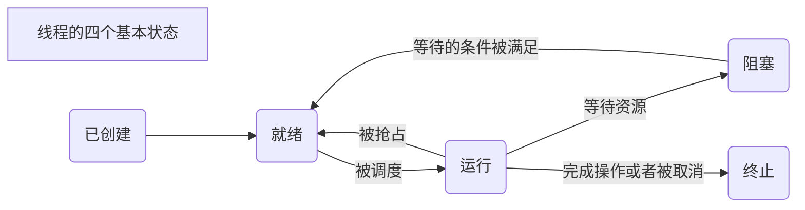
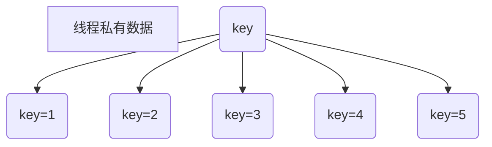
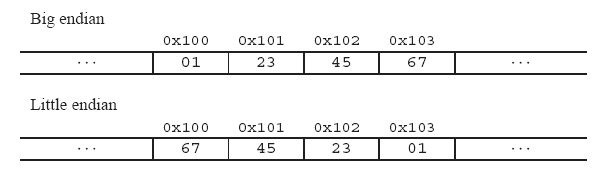

# Linux多线程设计

## 多线程的简单概念

Linux的错误码在`/usr/inculde/asm-generic/errno.h`

### 什么是线程

进程：一个正在执行的程序，它是**资源分配**的最小单位

进程出现了很多弊端

1. 由于进程是资源拥有者，创建、撤销与切换存在较大的空间开销，因此需要引入轻型进程；
2. 由于对称多处理机（SMP）出现，可以同时满足多个运行单元，而多个进程并行开销过大

线程：有时又称为轻量级进程，**程序执行**的最小单位，**系统独立调度**和**分派cpu**的基本单位，它是进程中的一个实体。一个进程中可以有多个线程，这些线程共享进程的所有资源，线程本生只包含一点必不可少的资源。

### 线程相关

并发：并发是指在同一时刻，只能有一条指令执行，但多个进程指令被快速轮换执行，使得在宏观上具有多个进程同时执行的效果。**单核处理，看起来是同时发生**

并行：并行是指在同一时刻，有多条指令在多个处理器上同时执行。**真正的同时发生**

同步：彼此有依赖关系的调用不应该“同时发生”，而同步就是要阻止那些“同时发生”的事情

异步：异步的概念和同步相对，任何两个彼此独立的操作系统是异步的，它表明事情独立的发生。

### 多线程的优势

1. 在多处理器中开发程序的并行性
2. 在等待慢速IO操作时，程序可以执行其他操作，提高并发性
3. 模块化的编程，能更清晰的表达程序中独立事件的关系，饥饿狗清晰
4. 占用较少的系统资源

多线程不一定要多处理器

## Linux线程的基本控制

### 线程的创造和生命

#### 创建新线程

|            |       线程       |       进程        |
| :--------: | :--------------: | :---------------: |
| 标识符类型 |    pthread_t     | pid_t(无符号整数) |
|   获取id   |  pthread_self()  |     getpid()      |
|    创建    | pthread_create() |      fork()       |

pthread_t：在FreeBSD5.2、Mac OS10.3中为结构体，在linux中为unsigned long int，定义在`/usr/include/bits/pthreadtypes.h`

```c
/*
*getpid()       获取进程id
*pthread_self() 获取线程id
*
*int pthread_create(pthread_t *thread, const *pthread_attr_t *attr,
*                          void *(*start_routine) (void *), void *arg);
*第一个参数，新线程id，创建成功系统回填
*第二个参数，新线程的属性，NULL为默认值
*第三个参数，新线程的启动函数
*第四个参数，传递给新线程的参数
*/
#include<stdio.h>
#include<pthread.h>
#include<stdlib.h>
#include<string.h>
#include<unistd.h>
#include<sys/types.h>
void printf_id(char *s){
    pid_t pid;
    pthread_t thread_id;
    
    pid = getpid();//获取父进程的id时getppid()
    thread_id = pthread_self();
    printf("%s Pid=%u,id=%lu\n",s,pid,thread_id);
};
void *thread_start(void *arg){
    printf_id(arg);
}
int main(){
    int flag;
    pthread_t thread_id;
    
    flag = pthread_create(&thread_id,NULL,&thread_start,"new thread:");
    if (flag != 0){
        printf("Create the thread failed!\n");
        return -1;
    }
    printf("Create the thread sucess!\n");
    printf_id("main thread:");
    sleep(2);
    
    return 0;
}
```

#### 线程的生命周期

1. 当c程序运行时，首先运行main函数；在线程代码中，这个特殊的执行流程被称作初始线程或者主线程；你可以在初始线程中做任何普通线程可以做的事情。主线程是随着进程的创建而创建；其它线程可以通过调用函数来创建，主要调用pthread_create；注意，新线程可能在当前线程从函数pthread_create返回之前就已经存在了，甚至新线程可能在当前线程从函数pthread_create返回之前就已经运行完毕了。
2. 主线程的特殊性在于，它在main函数返回的时候，会导致进程结束，进程内所有的线程也将会结束。这可不是一个好的现象，你可以在主线程中调用pthread_exit函数，这样进程就会等待所有线程结束时才终止
3. 主线程接受参数的方式是通过argc和argv，而普通的线程只有普一个参数void*
4. 在绝大多数情况下，主线程在默认堆栈上运行，这个堆栈可以增长到足够的长度，而普通进程的堆栈是受限制的，一旦溢出就会产生错误

线程的四个基本状态：

| 状态 |                            含义                            |
| :--: | :--------------------------------------------------------: |
| 就绪 |            线程能够运行，但是在等待可用的处理器            |
| 运行 |    线程正在运行，在多核系统中，可能同时有多个线程在运行    |
| 阻塞 |               线程在等待处理器以外的其他条件               |
| 终止 | 线程从启动函数中返回，或者调用pthread_exit函数，或者被取消 |

就绪：当线程刚被创建时就处于就绪状态，或者当线程被解除阻塞以后也会处于就绪状态。就绪的线程在等待一个可用的处理器，当一个运行的线程被抢占时，它立刻又回到就绪状态。

运行：当处理器选中一个就绪的线程执行时，它立刻变成运行状态

阻塞  ：线程会在以下情况下发生阻塞：试图加锁一个已经被锁住的互斥量、等待某个条件变量、调用singwait等待尚未发生的信号、执行无法完成的I/O信号或者由于内存页错误

终止：线程通常启动函数中返回来终止自己，，或者调用pthread_exit退出，或者取消线程



回收：分离一个正在运行的线程并不影响它，仅仅是通知当前系统，该线程结束时，其所属的资源可以回收。一个没有被分离的线程在终止时会保留它的虚拟内存，包括他们的堆栈和其他系统资源，于是这种线程被称为“僵尸线程”。**创建线程时默认是非分离的**

如果线程具有分离属性，线程终止时会被立刻回收，**回收将释放掉所有在线程终止时未被释放的系统资源和进程资源**，包括保存线程返回值的内存空间、堆栈、保存寄存器的内存空间等。

终止被分离的线程会释放所有的系统资源，但是你**必须释放由该进程占有的程序资源**（由malloc或者mmap分配的内存可以在任何时候由任何线程释放，条件变量、互斥量、信号灯可以由任意线程销毁，只要它们被解锁了或者没有线程等待。但是只有互斥量的主人才能解锁它，所以在线程终止前，你需要解锁互斥量）

### 线程基本控制

#### 线程终止

exit是危险的，如果进程中的任意一个线程调用了`exit、_Exit、_exit`，那么整个进程就会终止

不终止进程的退出方式

>普通的单个线程有以下3种方式推荐，这样不会终止进程
>
>1. 从启动例程中返回，返回值是线程的退出码
>2. 线程可以被同一进程中的其他线程取消
>3. 线程调用pthread_exit(void *rval)函数，rval是退出码
>
>return和pthread_exit的区别


#### 线程链接

`int pthread_join(pthread_t thread, void **retval)`

>调用该函数的线程会一直阻塞，直到指定的线程tid调用pthread_exit、从启动例程返回或者被取消
>
>参数tid就是指定线程的id，参数retval是指定线程的返回码，如果线程被取消，那么retval被置为PTHREAD_CANCLED，该函数调用成功会返回0，失败返回错误码
>
>调用pthread_join会使指定的线程处于分离状态，如果指定线程已经处于分离状态，那么调用就会失败（当一个线程通过pthread_join返回以后，其他线程就不能调用pthread_join链接该线程了）

 `int pthread_detach(pthread_t thread)`

>pthread_detach可以分离一个线程，线程可以自己分离自己；成功返回0，失败返回错误码

#### 线程取消

`int pthread_cancle(pthread_t tid)`

>取消tid指定的线程，成功返回0。取消只是发送一个请求，并不意味着等待线程终止，而且发送成功也不意味着tid一定会终止
>
>具体需要看**取消状态**

取消状态（取消状态，就是线程对取消信号的处理方式，忽略或是相应，线程创建时，默认响应取消信号）：

`int pthread_setcancelstate(int state,int *oldstate)`

> 设置本线程对Cancel信号的反应，state有两种值：PTHREAD_CANCEL_ENABLE（缺省）和PTHREAD_CANCEL_DISABLE，分别表示收到信号后设为CANCELED状态和忽略CANCEL信号继续运行，oid_state如果不为NULL则存入原来的cancel状态以便恢复

取消类型（是线程对取消信号的响应方式，立即取消或者延时取消。线程创建时默认延时取消）：

`int pthread_setcanceltype(int type,int *oldtype)`

>设置本线程取消动作的执行时机，type由两种取值：PTHREAD_CANCLE_DEFFERED和PTHREAD_CANCLE_ASYCHRONOUS，仅当cancel状态为Enable时有效，分别表示收到信号后继续运行至下一个取消点再退出和立即执行取消动作（退出），oldtype如果不为NULL则存入运来的取消动作类型值

取消点：取消一个线程，它通常需要被取消线程的配合。线程在很多时候会查看自己是否有取消请求，如果有就主动退出，这些查看是否有取消请求的地方被称为取消点（通过man pthreads可以查看）

>很多地方都包含取消点，包括pthread_join()、pthread_testcancel()、pthread_cond_wait()、pthread_cond_timewait()、sem_wait()、sigwait()、write、read大多数会阻塞系统的调用

```c
#include<stdio.h>
#include<unistd.h>
#include<pthread.h>
#include<sys/types.h>
#include<sys/shm.h>
#include<signal.h>
#include<sys/ipc.h>
void *thread_start(){
    pthread_setcancelstate(PTHREAD_CANCEL_DISABLE,NULL);
    printf("I am a new thread!\n");
    sleep(4);
    printf("Enable cancel!\n");
    pthread_setcancelstate(PTHREAD_CANCEL_ENABLE,NULL);
    printf("First cancel point\n");
	printf("Second cancel point\n");
	
	return (void *)2;
}
int main(){
    pthread_t tid;
    int ret1,ret2;
    int rval;
    
    ret1 = pthread_create(&tid,NULL,&thread_start,NULL);
    if (ret1 != 0){
        printf("Create the new thread failed!\n");
        return -1;
    }
    printf("Create the new thread sucess!\n");
    sleep(2);
    
    ret2 = pthread_cancel(tid);
    if(ret2 != 0){
        printf("Cancel the pthread send failed!\n");
        return -2;
    }
    printf("Cancel the pthread send sucess!\n");
    pthread_join(tid,(void *)&rval);
    printf("Cancel rval:%d\n",rval);
    printf("New thread exit code:%d\n",rval);
    return 0;
}
```


#### 向线程发送信号

`int pthread_kill(pthread_t thread,int sig)`

>向指定ID的线程发送sig信号，如果线程代码内不做处理，则按照信号默认的行为影响整个进程；也就是说，如果给一个线程发送了SIGQUIT，但线程却没有实现signal处理信号，则整个进程退出。
>
>pthread_kill不是kill，而是向线程发送signal。大部分signal的默认动作是终止进程的运行，所以，我们才要用sigaction()去抓信号并加上处理函数
>
>如果要获得正确的行为，就需要在线程内实现sigaction了
>
>所以，如果int sig的参数不是0，那一定要清楚到底要干什么，而且一定要实现线程的信号处理函数，否则就会影响整个进程；如果int sig是0，这是一个保留信号，其实并没有发送信号，作用是用来判断线程是不是还活着

进程信号处理：

`int sigaction(int signum,const struct sigaction *act,struct sigaction *oldact)`

>给信号signum设置一个处理函数，处理函数在sigaction中指定
>
>act.sa_mask信号屏蔽字
>
>act.sa_handler信号集处理程序

`int sigempty(sigset_t *set)`清空信号集

`int sigfillset(sigset_t *set)`将所有信号加入信号集

`int sigaddset(sigset_t *set,int signum)`增加一个信号到信号集

`int sigdelset(sigset_t *set,int signum)`删除一个信号到信号集

多线程信号屏蔽处理

`int pthread_sigmask(int how,const sigset_t *set,sigset_t *oldset)`

>how=SIG_BLOCK：向当前的 信号掩码中添加set，其中set表示要阻塞的信号组。
>
>SIG_UNBLOCK：向当前的信号掩码中删除set，其中set表示要取消阻塞的信号组。
>
>SIG_SETMASK：将当前的信号掩码替换为set，其中set表示新的信号掩码。
>
>在多线程中，新线程的当前信号掩码会继承创造它的 那个线程的信号掩码
>
>一般情况下，被阻塞的信号将不能中断此线程的执行，除非此信号的产生是因为程序运行出错，如SIGSEGV；另外不能被忽略处理的信号SIGKILL和SIGSTOP也无法被阻塞

#### 清除操作

注册/销毁清理函数

线程可以安排它退出时的清理操作，这与进程的可以用atexit函数安排进程退出时需要调用的函数类似。这样的函数称为**线程清理处理程序**。线程可以建立多个清理处理程序，处理程序记录在栈中，所以这些处理程序执行的顺序与它们注册的顺序相反

`void pthread_cleanup_push(void (*routine)(void *),void *arg)`注册处理程序

`void pthread_cleanup_pop(int excute)`清除处理程序

**这两个函数要成对的出现，否则编译无法通过**

当执行以下操作时调用清理函数，清理函数的参数由args传入

1. 调用pthread_exit
2. 响应取消请求
3. 用非零参数调用pthread_cleanup_pop

### 线程的同步

#### 互斥量

为什么要使用互斥量

>当多个线程共享相同的内存时，需要每一个线程看到相同的视图。当一个线程修改变量时，而其他线程也可以读取或者修改这个变量，就需要这些线程同步，确保他们不会访问到无效的变量
>
>在变量修改时间多于一个存储器访问周期的处理器结构中，当存储器的读和写这两个周期交叉时，这种潜在的不一致性就会出现。当然，这与处理器相关，但是在可移植的程序中并不能对处理器做出任何假设

互斥锁的初始化和销毁

>为了让线程访问数据不产生冲突，就需要对变量加锁，使得同一时刻只有一个线程可以访问变量。互斥量本质就是锁，访问共享资源前对互斥量加锁，访问完成后解锁
>
>当互斥量加锁以后，其他所有需要访问该互斥量的线程都将阻塞
>
>当互斥量解锁以后，所有因为这个互斥量阻塞的线程都将变为就绪态，第一个获得cpu的线程会获得互斥量，变为运行态，而其他线程会继续变为阻塞，在这种方法下访问互斥量，每次只有一个线程能向前执行
>
>互斥量用pthread_mutex_t类型的数据表示，在使用之前需要对互斥量初始化（/usr/include/bits/pthreadtypes.h）
>
>1. 如果是动态分配的互斥量，可以调用pthread_mutex_init()函数初始化
>2. 如果是静态分配的互斥量，还可以把它置为常量PYHREAD_MUTEX_INITIALIZER
>3. 动态分配的互斥量在释放内存之前需要调用pthread_mutex_destroy()

`int pthread_mutex_init(pthread_mutex_t *restrict mutex,const pthread_mutexattr_t *restrict attr)`

>第一个参数是要初始化的互斥量，第二个参数是互斥量的属性，默认为NULL

`int pthread_mutex_destroy(pthread_mutex_t *mutex)`

`pthread_mutex_t mutex = PYHREAD_MUTEX_INITIALIZER `

加锁和解锁

>**加锁**
>
>`int pthread_mutex_lock(pthread_mutex_t *mutex)`
>
>成功返回0，失败返回错误码。如果互斥量已经被锁住，那么会导致该线程阻塞
>
>`int pthread_mutex_trylock(pthread_mutex_t *mutex)`
>
>成功返回0，失败返回错误码。如果互斥量已经被锁住，不会导致线程阻塞
>
>**解锁**
>
>`int pthread_mutex_unlock(pthread_mutex_t *mutex)`
>
>成功返回0，失败返回错误码

#### 读写锁

`pthread_rwlock_t rwlock`

什么是读写锁，它与互斥锁的区别

>读写锁与互斥量类似，不过读写锁有更高的并行性。互斥量要么加锁要么不加锁，而且同一时刻只允许一个线程对其加锁。对于一个变量的读取，完全可以让多个线程同时进行操作
>
>读写锁有三种状态，读模式下加锁，写模式下加锁，不加锁。一次只有一个线程可以占有写模式下的读写锁，但是多个线程可以同时占有读模式的读写锁
>
>读写锁在写加锁状态时，在它被解锁之前，所有试图对这个锁加锁的线程都会阻塞。读写锁在读加锁状态时，所有试图以读模式对其加锁的线程都会获得访问权，但是，如果线程希望以写模式对其加锁，它必须阻塞直到所有的线程释放锁
>
>当读写锁以读模式加锁时，如果有线程试图以写模式对其加锁，那么读写锁会阻塞随后的读模式锁的请求。这样可以避免读锁长期占用，而写锁达不到请求
>
>读写锁非常适合对数据结构读次数大于写次数的程序，当它以读模式锁住时，是以共享的方式锁住的；当它以写模式锁住时，是以独占的模式锁住 的

读写锁的初始化和销毁

>读写锁在使用之前必须初始化
>
>`int pthread_rwlock_init(pthread_rwlock_t *restrict rwlock,
>           const pthread_rwlockattr_t *restrict attr);`
>
>使用完需要销毁
>
>`int pthread_rwlock_destroy(pthread_rwlock_t *rwlock)`
>
>成功返回0，失败返回错误码

加锁和解锁

>读模式加锁
>
>`int pthread_rwlock_rdlock(pthread_rwlock_t *rwlock)`
>
>`int pthread_rwlock_tryrdlock(pthread_rwlock_t *rwlock)`
>
>写模式加锁
>
>`int pthread_rwlock_wrlock(pthread_rwlock_t *rwlock)`
>
>`int pthread_rwlock_trywrlock(pthread_rwlock_t *rwlock)`
>
>解锁
>
>`int pthread_rwlock_unlock(pthread_rwlock_t *rwlock)`
>
>成功返回0

#### 条件变量

条件变量的引入

一个典型的实例：在一条生产线上有一个仓库，当生产者生产的时候需要锁住仓库独占，而消费者取产品的时候也要锁住仓库独占。如果生产者发现仓库满了，那么他就不能生产了，变成了阻塞状态。但是，此时由于生产者独占仓库，消费者又无法进入仓库去消耗产品，这样就造成了一个僵死状态。

我们需要一种机制，当互斥量被锁住以后，发现当前线程还是无法完成自己的操作，那么它应该释放互斥量，让其他线程工作。

1. 可以采用轮询的方式，不停的查询你需要的条件
2. 让系统来帮你查询条件，使用条件变量`pthread_cond_t cond`

条件变量的初始化和销毁

>条件变量使用之前需要初始化
>
>1. `pthread_cond_t cond = PTHREAD_COND_INITIALIZER`
>2. `int pthread_cond_init(pthread_cond_t *restrict cond,const pthread_condattr_t *restrict attr)`属性默认为空
>
>条件变量使用完成之后需要销毁
>
>`int pthread_cond_destroy(pthread_cond_t *cond)`

条件变量的使用

条件变量使用需要配合互斥量

`int pthread_cond_wait(pthread_cond_t *restrict cond, pthread_mutex_t *restrict mutex)`

1. 使用pthread_cond_wait等待条件变为真。传递给pthread_cond_wait的互斥量对条件进行保护，调用者把锁柱的互斥量传递给函数
2. 这个函数将线程放到等待条件的线程列表上，然后对互斥量进行解锁，这是个原子操作。当条件满足时，这个函数返回，返回以后继续对互斥量加锁

`int pthread_cond_timedwait(pthread_cond_t *restrict cond,pthread_mutex_t *restrict mutex,const struct timespec *restrict abstime)`

3. 这个函数与pthread_cond_wait类似，只是多一个timeout，如果到了指定的时间条件还不满足，那么就返回。时间用下面的结构体表示

   struct timespec{

     time_t tv_sec;

     long tv_nsec;

   }

   注意，这个时间是绝对时间。例如你要等3分钟，就要把当前时间加上3分钟，然后转换到timespec，而不是直接将3分钟转换到timespec

当条件满足的时候，需要唤醒等待条件的线程

`int pthread_cond_broadcast(pthread_cond_t *cond)`

`int pthread_cond_signal(pthread_cond_t *cond)`

1. pthread_cond_broadcast唤醒等待条件的所有线程

2. pthread_cond_signal至少唤醒等待条件的某一个线程

   注意：一定要在条件改变以后再唤醒线程

```c
#include<stdio.h>
#include<unistd.h>
#include<pthread.h>
#include<sys/types.h>
#include<sys/shm.h>
#include<signal.h>
#include<sys/ipc.h>

#define BUFFER_SIZE 5//产品库存大小
#define PRODUCT_CNT 30//产品生产总数

struct product_cons{
	int buffer[BUFFER_SIZE];//生产产品品值
	pthread_mutex_t lock;   //互斥锁
	int readpos,writepos;  //读写位置
	pthread_cond_t noempty; //条件变量，非空
	pthread_cond_t nofull;  //非满
}buff;

void init(struct product_cons *p){
	pthread_mutex_init(&p->lock,NULL);   //互斥锁
	pthread_cond_init(&p->noempty,NULL); //条件变量
	pthread_cond_init(&p->nofull,NULL);  //条件变量
	p->readpos = 0;                      //读写位置
	p->writepos = 0;
}

void finish(struct product_cons *p){
	pthread_mutex_destroy(&p->lock);   //互斥锁
	pthread_cond_destroy(&p->noempty); //条件变量
	pthread_cond_destroy(&p->nofull);  //条件变量
	p->readpos = 0;                         //读写位置
	p->writepos = 0;
}
//存储一个数据到buffer
void put(struct product_cons *p, int data){//输入产品子函数
	pthread_mutex_lock(&p->lock);
	if((p->writepos+1)%BUFFER_SIZE == p->readpos){
		printf("Producer wait for not full\n");
		pthread_cond_wait(&p->nofull,&p->lock);
	}
	p->buffer[p->writepos] = data;
	p->writepos++;
	
	if(p->writepos >= BUFFER_SIZE)
		p->writepos = 0;
	
	pthread_cond_signal(&p->noempty);
	pthread_mutex_unlock(&p->lock);
}
//读，移除一个数据从buffer
int get(struct product_cons *p){
	int data;
	pthread_mutex_lock(&p->lock);
	if(p->readpos == p->writepos){
		printf("Consumer wait for not empty\n");
		pthread_cond_wait(&p->noempty,&p->lock);
	}
	data = p->buffer[p->readpos];
	p->readpos++;
	
	if(p->readpos >= BUFFER_SIZE)
		p->readpos = 0;
	
	pthread_cond_signal(&p->nofull);
	pthread_mutex_unlock(&p->lock);
	return data;
}

void *produce(){//子线程，生产
	for(int n = 1;n <= 35;n++){
		sleep(1);
		printf("Put the %d product ... \n",n);
		put(&buff,n);
		printf("Put thr %d product sucess!\n",n);
	}
	printf("Producer stopped\n");
}
void *consumer(){
	static int cnt = 0;
	int num;
	while(1){
		sleep(2);
		printf("Get product  ... \n");
		num = get(&buff);
		printf("Get the %d product sucess\n",num);
		if(++cnt == PRODUCT_CNT)
			break;
	}
	printf("Consumer stopped\n");
}
int main(){
	pthread_t tid1, tid2;
	void *retval1;
	void *retval2;
	
	init(&buff);
	
	pthread_create(&tid1,NULL,produce,NULL);
	pthread_create(&tid2,NULL,consumer,NULL);
	pthread_join(tid1,&retval1);
	pthread_join(tid2,&retval2);
	
	finish(&buff);
	
	return 0;
}
```


## Linux线程高级控制

### 线程的特殊性质

#### 一次性初始化

有些事需要且只能执行一次（比如互斥量初始化）。通常当初始化应用程序时，可以比较容易地将其放在main函数中。但当你写一个库函数时，就不能在main里面初始化了，你可以用静态初始化，但使用一次初始化（pthread_once_t）会比较容易些

首先，要定义一个pthread_once_t变量，这个变量要用宏PTHREAD_ONCE_INIT初始化。然后，创建一个与控制变量相关地初始化函数

```c
pthread_once_t once_control = PTHREAD_ONCE_INIT;

void init_routine(){

//初始化互斥量

//初始化读写锁

......

}
```

接下来就可以在任何时刻调用pthread_once函数

`int pthread_once(pthread_once_t* once_control, void (*init_routine)(void))`

功能：本函数使用初值为PTHREAD_ONCE_INIT的once_control变量保证init_routine()函数在本进程执行序列中仅执行一次，究竟在哪个线程中执行是不定的，是由内核调度来决定

Linux Threads使用互斥锁和条件变量保证由pthread_once()指定的函数执行且仅执行一次。实际“一次性函数”的执行状态有三种：NEVER(0)、IN_PROGRESS(1)、DONE(2)，用once_control来表示pthread_once()的执行状态；

1. 如果once_control初值为0，那么pthread_once从未执行过，init_routine()函数会执行；
2. 如果once_control初值设为1，则由于所有pthread_once()都必须等待其中一个激发“已执行一次”信号，因此，所有pthread_once()都会陷入永远的等待中，init_routine()就无法执行
3. 如果once_control设为2，则表示pthread_once()函数已执行过一次，从而所有pthread_once()都会立即返回，init_routine()就没有机会

当pthread_once函数成功返回，once_control就会被设置为2

#### 线程属性

线程的属性用pthread_attr_t类型的结构表示，在创建线程的时候可以不用传入NULL，而是传入一个pthread_attr_t结构，由用户自己来培训配置线程的属性

pthread_attr_t类型对应用程序是不透明的，也就说应用程序不需要了解有关属性对象内部结构的任何细节，因而可以增加程序的可移植性

线程属性

|    名称     |                描述                |
| :---------: | :--------------------------------: |
| detachstate |           线程的分离状态           |
|  guardsize  | 线程栈末尾的警戒区域大小（字节数） |
|  stacksize  |          线程栈的最低地址          |
|  stacksize  |       线程栈的大小（字节数）       |

并不是所有的系统都支持线程的这些属性，因此，你需要检查当前系统是否支持你设置的属性；当然，还有一些属性不包含在pthread_attr_t结构中，例如：线程的可取消状态、取消类型、并发度

pthread_attr_t结构在使用之前需要初始化，使用完之后需要销毁

线程属性初始化`int pthread_attr_init(pthread_attr_t *attr)`

线程属性销毁`int pthread_attr_destroy(pthread_attr_t *attr)`

如果在调用pthread_attr_init初始化属性的时候分配了内存空间，那么pthread_attr_destroy将释放内存空间。除此之外，pthread_attr_destroy还会用无效的值初始化pthread_attr_t对象，因此，如果该属性对象被误用，会导致创建线程失败

线程的分离属性

分离一个正在运行的线程并不影响它，仅仅是通知当前系统该线程结束时，其所属的资源可以回收。一个没有被分离的线程在终止时会保留它的虚拟内存，包括它们的堆栈和其他系统资源，有时这种线程被称为“僵尸线程”。**创建线程时默认是非分离的**

如果线程具有分离属性，线程终止时会被立刻回收，回收将释放掉所有在线程终止时未释放的系统资源和进程资源，包括保存线程返回值的内存空间、堆栈、保存寄存器的内存空间等。

如果在创建线程的时候就知道不需要了解线程的终止状态，那么可以修改pthread_attr_t结构体的detachstate属性，让线程以分离状态启动。可以使用pthread_attr_setdetachstate函数来设置线程的分离状态属性。线程的分离属性有两种合法值：PTHREAD_CREATE_DETACHED分离的、PTHREAD_CREATE_JOINABLE非分离的可连接的

`int pthread_attr_setdetachstate(pthread_attr_t *attr,int detachstate)`

使用pthread_attr_getdetachstate可以获得线程的分离状态属性

`int pthread_attr_getdetachstate(pthread_attr_t *attr,int *detachstate)`

设置线程分离属性的步骤

1. 定义线程属性变量pthread_attr_t attr
2. 初始化attr，pthread_attr_init(&attr)
3. 设置线程为分离火非分离pthread_attr_setdetachstate(&attr,detachstate)
4. 创建线程pthread_create(&tid,&attr,thread_fun,NULL)

所有的系统都会支持线程的分离状态属性

**线程栈属性**

对于进程来说，虚拟地址空间的大小是固定的，进程中只有一个栈，因此它的大小通常不是问题。但是对于线程来说，同样的虚拟地址被所有的线程共享。如果应用程序使用了太多的线程，致使线程栈累计超过可用的虚拟地址空间，这个时候就需要减少线程默认的栈大小。另外，如果线程分配了大量的自动变量或者线程的栈帧太深，那么这个时候需要的栈比默认的大。

如果用完了虚拟地址空间，可以使用malloc或者mmap来为其他栈分配空间，并修改栈的位置。

修改栈属性`int pthread_attr_setstack(pthread_attr_t *attr, void *stackaddr, size_t stacksize)`

获取栈属性`int pthread_attr_getstack(pthread_attr_t *attr, void **stackaddr, size_t *stacksize)`

参数stackaddr是栈的内存单元最低地址，参数stacksize是栈的大小。你要注意stackaddr并不一定是栈的开始，对于一些处理器，栈的地址是从高往低的，那么stackaddr是栈的结尾

当然也可以单独获取或者修改栈的大小，而不去修改栈的地址。对于栈大小设置，不能小于PTHREAD_STACK_MIN（需要头文件limit.h）通过`ulimit -s`查看PTHREAD_STACK_MIN大小，单位为字节

`int pthread_attr_setstacksize(pthread_attr_t *attr, size_t stacksize)`

`int pthread_attr_getstacksize(pthread_attr_t *attr, size_t *stacksize)`

对于栈大小的设置，在创建线程之后，还可以修改

对于遵循POSIX标准的系统来说，不一定要支持线程的栈属性，因此你需要检查

1. 在编译阶段使用`_POSIX_THREAD_ATTR_STACKADDR`和`_POSIX_THREAD_ATTR_STACKSIZE`符号来检查系统是否支持线程栈属性，这些宏定义在`/usr/include/bits/posix_opt.h`
2. 在运行阶段，把`_SC_THREAD_ATTR_STACKADD`和`_SC_THREAD_THREAD_ATTR_STACKSIZE`传递给sysconf函数，检查系统对线程栈属性的支持

栈尾警戒区

线程属性guardsize控制着线程栈末尾以后用以避免栈溢出的扩展内存的大小，这个属性默认是PAGESIZE个字节。你可以把它设为0，这样就不会提供警戒缓冲区。同样的，如果你修改了stackaddr，系统会认为你自己要管理栈，警戒缓冲区会无效。

设置guardsize`int pthread_attr_setguardsize(pthread_attr_t *attr, size_t guardsize)`

获取guardsize`int pthread_attr_getguardsize(pthread_attr_t *attr,size_t *guardsize)`

```c
#include<stdio.h>
#include<pthread.h>
#include<stdlib.h>
#include<string.h>
#include<unistd.h>
#include<sys/types.h>
#include<limits.h>

pthread_attr_t attr;

void *thread_start(){
	size_t size;
#ifdef _POSIX_THREAD_ATTR_STACKADDR
	pthread_attr_getstacksize(&attr,&size);
#endif
	printf("The size is %d\n", size);
}

int main(){
	pthread_t tid;
	
	pthread_attr_init(&attr);
	
	pthread_attr_setdetachstate(&attr, PTHREAD_CREATE_JOINABLE);
	//pthread_attr_setdetachstate(&attr, PTHREAD_CREATE_DETACHED);
#ifdef _POSIX_THREAD_ATTR_STACKADDR
	pthread_attr_setstacksize(&attr,PTHREAD_STACK_MIN);
#endif

    pthread_create(&tid, &attr,thread_start,NULL);
	pthread_join(tid,NULL);
	pthread_attr_destroy(&attr);
	
	return 0;
}
```

#### 线程的同步属性

**互斥量的属性**

就像线程有属性一样，线程的同步互斥量也有属性，比较重要的是进程共享属性和类型属性。互斥量的属性用pthread_mutexattr_t类型的数据表示，当然在使用之前必须进行初始化，使用完成之后需要进行销毁

互斥量初始化`int pthread_mutexattr_init(pthread_mutexattr_t *attr)`

互斥量销毁`int pthread_mutexattr_destroy(pthread_mutexattr_t *attr)`

1. 进程共享属性

   PTHREAD_PROCESS_PRIVATE，这个是默认值，同一个进程中的多个线程访问同一个同步对象

   PTHREAD_PROCESS_SHARED，这个属性可以使互斥量在多个进程中进行同步，如果互斥量在多进程的共享内存区域，那么具有这个属性的互斥量可以同步多进程

   设置互斥量进程共享属性`int pthread_mutexattr_setpshared(pthread_mutexattr_t *attr, int pshared)`

   `int pthread_mutexattr_getshared(const pthread_mutexattr_t *restrict attr,int *restrict pshared)`

   进程共享属性需要检测系统是否支持，可以检测宏`_POSIX_THREAD_PROCESS_SHARED`

2. 类型属性

   |       互斥量类型        | 没有解锁时再次加锁 | 不占用时解锁 | 已解锁时解锁 |
   | :---------------------: | :----------------: | :----------: | :----------: |
   |  PTHREAD_MUTEX_NORMAL   |        死锁        |    未定义    |    未定义    |
   | PTHREAD_MUTEX_ERRORCHEK |      返回错误      |   返回错误   |   返回错误   |
   | PTHREAD_MUTEX_RECURSIVE |        允许        |   返回错误   |   返回错误   |
   |  PTHREAD_MUTEX_DEFAULT  |       未定义       |    未定义    |    未定义    |

   设置互斥量的类型属性

   ​	`int pthread_mutexattr_settype(pthread_t *attr,int type)`

   `int pthread_mutexattr_gettype(const pthread_mutexattr_t *restrict attr)`

   

**读写锁的属性**

只有一个进程共享属性

读写锁属性初始化

`int pthread_rwlockattr_init(pthread_rwlockattr_t *attr)`

`int pthread_rwlockattr_destroy(pthread_rwlockattr_t *attr)`

设置读写锁进程共享属性

`int pthread_rwlockattr_setpshared(pthread_rwlockattr_t *attr,int pshared)`

`int pthread_rwlockatte_getpshared(const pthread_rwlockattr_t *restrict attr,int *restrict pshared)`

**条件变量的属性**

条件变量也有进程共享属性

条件变量属性初始化

`int pthread_condattr_init(pthread_condattr_t *attr)`

`int pthread_condattr_destroy(pthread_condattr_t *attr)`

设置条件变量属性

`int pthread_condattr_setpshared(pthread_condattr_t *attr, int pshared)`

`int pthread_condattr_getpshared(const pthread_condattr_t *restrict attr, int *restrict pshared)`

#### 线程私有数据

应用程序设计中有必要提高一种变量，使得多个函数多个线程都可以访问这个变量（看起来是个全局变量），但是，线程对这个变量的访问都不会彼此产生影响（貌似不是全局变量），但是，你需要这样的数据，比如errno。那么，这种数据就是线程的是有数据，尽管名字相同，但是每个线程访问的都是数据的副本。

使用私有数据之前，你首先要创建一个与私有数据相关的键，要来获取对私有数据的访问权限，这个键的类型是pthread_key_t



`int pthread_key_create(pthread_key_t *key,void (*destructor)(void*))`

创建的键放在key指向的内存单元，destructor是与键相关的析构函数。当线程调用pthread_exit或者使用return返回，析构函数就会被调用。当析构函数调用的时候，它只有一个参数，这个参数是与key关联的那个数据的地址（也就是你的私有数据），因此，你可以在析构函数中将这个数据销毁。

键使用完之后也可以销毁，**当键销毁之后，与它关联的数据并没有销毁**

`int pthread_key_delete(pthread_key_t key)`

有了键之后，你就可以将私有数据和键关联起来，这样就可以通过键来找到数据。所有的线程都可以访问这个键，但它们可以为键关联不同的数据。（是一个名字一样，而值却不同的全局变量）

将私有数据与key关联

`int pthread_setspecific(pthread_key_t key,const void *value)`

获取私有数据的地址，如果没有数据与key关联，那么返回空

`void *pthread_getspecific(pthread_key_t key)`

#### 线程与fork

当线程调用 fork函数时，就为子进程创建了整个进程地址空间的副本，子进程通过继承整个地址空间的副本，也会将父进程的互斥量、读写锁、条件变量的状态集成过来。也就是说，如果父进程中互斥量时锁着的，那么在子进程中互斥量也是锁着的（尽管子进程自己还没有来得及lock），这是非常不安全的，因为不是子进程自己锁住的，它无法解锁。

```c
#include<stdio.h>
#include<pthread.h>
#include<stdlib.h>
#include<string.h>
#include<unistd.h>
#include<sys/types.h>
#include<limits.h>

pthread_mutex_t mutex = PTHREAD_MUTEX_INITIALIZER;

void *thread_start(){
	sleep(1);
	pid_t pid;
	pid = fork();
	if(pid == 0){
		pthread_mutex_lock(&mutex);
        //会将父进程的互斥量、读写锁、条件变量的状态集成过来。也就是说，如果父进程中互斥量时锁着的，那么在子进程中互斥量也是锁着的；再次加锁，进入死锁
		printf("Child pthread!\n");
		pthread_mutex_unlock(&mutex);
	}
	if(pid > 0){
		pthread_mutex_lock(&mutex);
		printf("Father pthread!\n");
		pthread_mutex_unlock(&mutex);
	}
	
	
}
int main(){
	pthread_t tid;
	
	if(pthread_create(&tid, NULL,thread_start,NULL)){
		printf("Create the pthread failed!\n");
	}
	printf("Create the pthread sucess!\n");
	pthread_mutex_lock(&mutex);
	printf("Lock mutex!\n");
	sleep(2);
	pthread_mutex_unlock(&mutex);
	printf("Unock mutex!\n");
	pthread_join(tid,NULL);
    pthread_mutex_destroy(&mutex);
    
	return 0;
}
```

子进程内部只有一个线程，由父进程中调用fork函数的线程副本构成。如果调用fork的线程将互斥量锁住，那么子进程会拷贝一个pthread_mutex_lock副本，这样子就有机会去解锁了（如下情况）

```c
void *thread_start(){
	sleep(1);
	pid_t pid;
    pthread_mutex_lock(&mutex);
	pid = fork();
	if(pid == 0){
		printf("Child pthread!\n");
		pthread_mutex_unlock(&mutex);
	}
	if(pid > 0){
		printf("Father pthread!\n");
		pthread_mutex_unlock(&mutex);
	}
	
}
```

或者互斥量根本就没有被加锁，这样也是可以的，但是你不能确保永远是这样的情况。

pthread_atfork函数给你创造了这样的条件，它会注册三个函数

`int pthread_atfork(void(*prepare)(void),void (*parent)(void),void (*child)(void))`

prepare是在fork调用之前会被调用的，parent在fork返回父进程之前调用，child在fork返回子进程之前调用。如果在prepare中加锁所有的互斥量，在parent和child中解锁所有的互斥量，那么在fork返回之后，互斥量的状态就是未加锁。

可以有多个pthread_atfork函数，这时也就会有多个处理程序（prepare、parent、child）。**多个prepare的执行顺序与注册顺序相反，而parent和child的执行顺序与注册顺序相同**

## Linux多线程综合练习

### 多线程并发服务器

#### 多线程概念、优势、使用

线程：有时又称为轻量级进程，**程序执行的最小单位**（**进程是资源分配的最小单元**），系统独立调度和分派CPU的基本单元，它是进程中的一个实体。一个进程中可以有多个线程，这些线程共享进程的所有资源，线程本身只包含一点必不可少的资源。

同步、异步、并发、并行

优势：

1. 在多处理器中开发程序的并行性
2. 在等待慢速IO操作时，程序可以执行其他操作，提高并发性
3. 模块化的编程，能更清晰的表达程序中独立事件的关系，结构清晰
4. 占用较少的系统资源

线程创造，获取ID，生命周期

线程控制：终止、连接、取消、发送信号、清楚操作

线程同步：互斥量、读写锁、条件变量

线程高级控制：一次性初始化、线程属性、同步属性、私有数据、安全的fork

#### 基于多线程的TCP并发服务器

Socket（套接字）实质上提供了进程通信的端点，进程通信之前，双方首先必须各自建立一个端点，否则是没有办法通信的。通过socket将IP地址和端口绑定之后，客户端就可以和服务器通信了

当访问套接字时，要像访问文件一样使用文件描述符

创造一个套接字可以使用socket()函数

```c
#include<sys/socket.h>
int socket(int domain,int type,int protocol)
```

返回值：成功则返回套接字文件描述符，失败返回-1

参数domain：通信域，确定通信特性，包括地址格式

|    域     |     描述     |
| :-------: | :----------: |
|  AF_INET  | IPv4因特网域 |
| AF_INET6  | IPv6因特网域 |
|  AF_UNIX  |    unix域    |
| AF_UNSPEC |    未指定    |

参数type：套接字类型

| 类型           | 描述                                   |
| -------------- | -------------------------------------- |
| SOCK_DGRAM     | 长度固定的、无连接的不可靠报文传输     |
| SOCK_RAM       | IP协议的数据报接口                     |
| SOCK_SEQPACKET | 长度固定、有序、可靠的面向连接报文传递 |
| SOCK_STREAM    | 有序、可靠、双向的面向连接的字节流     |

参数protocol：指定相应的传输协议，也就是注入TCP或UDP协议等等，系统针对每一个协议簇与类型提供了一个默认的协议，我们通过把protocol设置为0来使用这个默认的值。

在socket程序设计中，struct sockaddr_in（或者struct sock_addr）用于记录网络地址

```c
struct sockaddr_in{
    short int sin_family;/*协议簇*/
    unsigned short int sin_port;/*端口号*/
    struct in_addr sin_addr;/*协议特定地址*/
    unsigned char sin_zero[8];/*填0*/
}
typedef struct in_addr{
    union{
        struct{
            unsigned char s_b1,
            s_b2,
            s_b3,
            s_b4;
        }S_un_b;
        struct{
            unsigned short s_w1;
            s_w2;
        }S_un_w;
        unsigned long s_addr;
    }S_un;
}IN_ADDR;
```

IP地址通常由数字加点（192.168.0.1）的形式表示，而在struct in_addr中使用的IP地址是由32位的整数表示的，为了转换我们可以使用下面两个函数：

`int inet_aton(const char *cp,struct in_addr *inp)`

`char *inet_ntoa(struct in_addr in)`

函数里面a代表ascii，n代表network。inet_aton是将a.b.c.d形式的IP转换为32位的IP，存储在inp指针里面。inet_ntoa是将32位IP转换为a.b.c.d的格式。字节序转换

不同类型的CPU对变量的字节存储顺序可能不同：有的系统是高位在前，低位在后，而有的系统是低位在前，高位在后，而网络传输的数据顺序是一定要统一的。所以当内部字节存储顺序和网络字节序不同时（big endian），就一定要进行转换

字节序转换，32bit的整数（0x01234567）从地址0x100开始：



htons把unsigned short类型从主机序转换到网络序

htonl把unsigned long类型从主机序转换到网络序

ntohs把unsigned short类型从网络序转换到主机序

ntohl把unsigned long类型从网络序转换到主机序

**bind**

绑定服务器的地址和端口到socket，这样做就是让客户端来发现用以连接的服务器地址

```c
#include<sys/socket.h>
int bind(int sockfd,const struct sockaddr *addr,socklen_t len)
```

返回值：成功返回0，失败返回-1

参数sockfd：服务器socket

参数addr：服务器的地址，对于因特网域，如果没有设置地址为INADDR_ANY，套接字可以绑定到所有的网络端口。这意味着可以收到这个系统所有网卡的数据包。一般使用sockaddr_in类型的结构体代替sockaddr结构体

参数len：addr的长度

**listen**

设置允许的最大连接数，使用函数listen()

```c
#include<sys/socket.h>
int listen(int sockfd,int backlog)
```

返回值：成功返回0，失败返回-1

参数backlog：用于表示服务器能接受的请求数量

**accept**

等待来自客户端的连接请求，使用函数accept()。一旦服务器调用了listen，套接字就能接收连接请求。使用函数accept函数来接受并建立请求

```c
#include<sys/socket.h>
int accept(int sockfd,struct sockaddr *restrict addr,socklen_t *restrict len)
```

参数sockfd：服务器socket

参数addr：用来存放客户端的地址，如果addr的空间足够大，系统会自动填充

参数len：addr的产犊

如果不关心客户端ip，那么addr和len可以设为NULL

返回值：成功则返回套接字描述符，失败返回-1

注意：1. accept返回一个新的socket关联到客户端，它与原始的socket有相同的套接字类型和协议簇。传递给accept的原始socket并没有关联客户端。它要继续保持可用状态，收敛其他请求

2. accept是一个阻塞的函数，会一直等到有客户端的请求

收发数据，用函数recv()、send()/sendto()或者read()、write()；关闭网络连接，close()

```c
#include<sys/socket.h>
#include<sys/types.h>
#include<stdio.h>
#include<stdlib.h>
#include<errno.h>
#include<string.h>
#include<unistd.h>
#include<arpa/inet.h>
#include<netinet/in.h>
#include<pthread.h>

#define MAX_LISTEN_NUM 10

int cfd[MAX_LISTEN_NUM], i = 0;
char buf[100] = {0};
struct sockaddr_in server_ip, client_ip;

void *thread_start(void *arg){
	while(1){
		read(cfd[(int)arg],buf,100);
		printf("Buf is: %s\n",buf);
		memset(&buf,0,100);
	}
}

int main(){
	int err, sfd;
	socklen_t addr_size;
	pthread_t tid[MAX_LISTEN_NUM];
	
	sfd = socket(AF_INET, SOCK_STREAM, 0);
	//创建socket
	if(sfd == -1){
		printf("Socket failed! Error number:%d\n",errno);
		return -1;
	}
	printf("Socket sucess!\n");
	
	server_ip.sin_family = AF_INET;
	server_ip.sin_port = htons(5678);
	server_ip.sin_addr.s_addr = htonl(INADDR_ANY);
	memset(&server_ip.sin_zero,0,8);//设置服务器的ip信息
	
	if(bind(sfd, (struct sockaddr *)&server_ip, sizeof(struct sockaddr_in)) == -1){
		//绑定服务器的地址和端口到socket
		printf("Bind failed!Error number:%d\n",errno);
		close(sfd);
		return -2;
	}
	printf("Bind sucess!\n");
	
	if(listen(sfd,MAX_LISTEN_NUM) == -1){//设置最大连接数
		printf("Listen failed!Error number:%d\n",errno);
		close(sfd);
		return -3;
	}
	printf("Listen sucess!\n");
	
	addr_size = sizeof(struct sockaddr_in);//获取客户端ip地址的长度
	while(1){
		cfd[i] = accept(sfd, (struct sockaddr *)&client_ip, &addr_size);
		//实现多个客户端对服务器的访问；服务器循环的创建新的cfd（socket）来接收新的客户端的连接请求
		if(cfd[i] == -1){
			printf("Accept failed!Error number:%d\n",errno);
			close(sfd);
			return -4;
		}
		err = pthread_create(&tid[i], NULL, &thread_start, (void *)i);
		//创建新的线程，新线程中，循环进行数据的读取
		if(err != 0){
			printf("Create thread failed!\n");
			close(cfd[i]);
			close(sfd);
			return -5;
		}
		i++;
	}
	
	close(sfd);
	
	return 0;
}
```

tcp客户端创建的步骤：

1. 创建一个socket，使用函数socket()
2. 设置要连接的服务器地址和端口
3. 连接服务器，使用函数connect()
4. 收发数据，用函数recv()、send()/sendto()或者read()、write()
5. 关闭网络连接close

客户端与服务器之间的数据交换是双向的，互不影响，因此需要两个单独的线程读和写；在服务器上有thread_read和thread_write，在客户端上有thread_write和thread_read