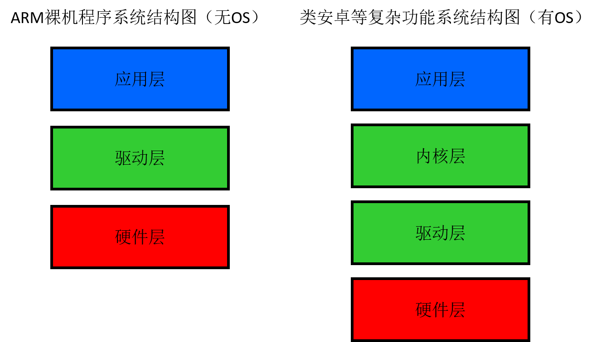
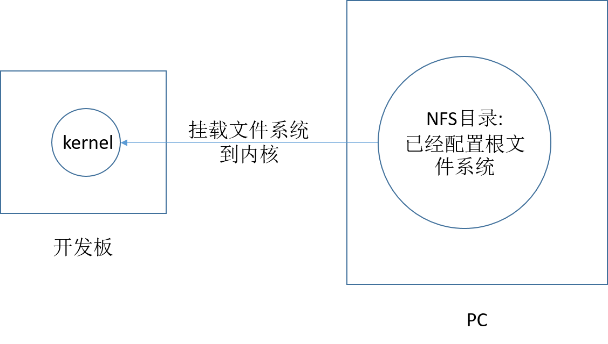

# 系统移植（嵌入式Linx底层驱动开发）

## 嵌入式Linux系统移植

### 了解系统移植

要点：

1. 搭建交叉开发环境
2. `bootloder`的选择和移植 
3. kernel的配置、编译、移植和调试 
4. 根文件系统的制作 

#### 概述



#### 移植的基本步骤

1. 确定目标机、主机的连接方式

   目标机与PC机的连接方式：

   * UART异步串行通信接口（串口）：速率低、实用性强
   * USB串行通信接口：速度快、驱动要移植修改
   * TCP/IP网络通信接口：速度快、驱动要移植
   * Debug Jtag调试接口：方便快捷、价格高

2. 安装交叉编译器

3. 搭建主机-目标机数据传输通道（网络相关服务器配置：TFTP用于传递数据、NFS挂载用于调试）

4. 编译三大子系统（bootloader、Linux kernel、文件系统）

5. 烧写测试

#### 交叉编译环境

`file`查看生成文件运行的平台

工具集介绍（加arm-linx之类的前缀）：readelf（查看Linux文件头）、size、nm（符号表）、strip（剔除符号表）、strings（查看可执行程序的常量字符串）、objdump（反汇编）、objcopy（拷贝程序的部分段，相当于提出生成文件中字符表等不需要的内容，使生成的二进制文件更加精简`arm-linux-objcopy -O binary 输入文件 输出文件.bin`）、addr2line

Linu系统下的命令：hexdump -C（同时显示16进制和ASCII码）

#### 系统移植初探

##### uboot（bootloader的子功能和软件）常用命令介绍

* print查看uboot这个软件的环境变量

* setenv（添加、删除和修改一个变量）、saveenv（把本次设置的环境变量写回存储器）

* 网络层的设置：`setenv ipaddr xxxxxxx`，板子pingPC

* nand

  nand [动词] [内存地址] [nandflash的内部地址] [搬移大小]

  动词：erase、write、read

  从nand中5M空间读到内存21000000 1K（1M：2^20-->100000...0-->0x100000）

  `nand read 21000000 500000 1024`

  `nand erase 500000 1024`

  从内存21000000地址处，写1K到nand的5M空间

  `nand write 21000000 500000 1024`（最后实际的写大小是按照硬件的页）

* tftp：UDP协议，C/S

  **Client：开发板**

  tftp的一般形式：`./client server_ip port xxxxx`

  在uboot中，server_ip变成了通过环境变量server_ip来获得

  port：tftp中已经固定好

  xxxxx：干什么事情

  uboot中实际命令例子：`tftp 20008000 abc.c`，该命令实现将服务端共享目录下的abc.c文件的内容拷贝到20008000地址处，如果将PC指针指向该处，则可以直接执行（类似运行内核的流程：拷贝内核到指定地址，把指针指向该地址）；拷贝之后，使用`md 20008000`命令可以查看对应地址的内容

  **Server：服务端**

  windows中安装tftp32软件，配置好Client端的地址和共享目录即可，直接配置好就行，不需要点任何按钮

  Linux安装tftp服务端库

  Linux通过`netstat -ua`可以查看UDP的服务

* bootm

  把uImage头进行解析

  uImage、zImage、Image、bzImage都是内核二进制文件，其中zImage、Image、bzImage都是原始内核数据包，只是压缩格式不同，uIamge相比其他，其包含了uboot所需的头。

* go

  只定PC指针的位置

##### 内核启动条件

* bootargs启动参数：

  root=启动的根文件系统在哪个设备

  设备信息 RAM、NFS、FLASH

  init=内核启动后，第一个可执行init进程从哪里来

  console=内核启动时，使用哪个设备作为控制台

  

  **注意：**shell是应用程序，其必须存储在目录中，且其目录必须挂载到根目录；shell没有启动时，或者没有文件系统时，只是用户没办法交互，实际内核已经运行起来了。

* 文件系统

  

  

##### 文件系统的烧写

* Ramdisk 内存磁盘

  `root=/dev/ram initrd=0x21000000,8M`

  `root=/dev/ram`为启动根文件的设备，`initrd=0x21000000,8M`为设备信息

  `setenv bootargs root=/dev/ram initrd=0x21000000,8M init=/linuxrc console=ttySAC0,115200`

  **Tig：**.gz压缩格式的文件，Linux会自解压

  ```c
  tftp 20008000 uImage//加载内核到20008000内存位置
  tftp 21000000 initrd.img.gz//加载文件系统到21000000
  setenv bootargs root=/dev/ram initrd=0x21000000,8M init=/linuxrc console=ttySAC0,115200
  bootm 20008000
  //内存分布为：20008000为uImge开始，21000000为initrd.img.gz开始
  ```

* NFS

  TCP/IP协议

  

  **服务端：**

  * 安装

    `sudo apt-cache search nfs-`搜索nfs有关的安装包

    `sudo apt-get install nfs-kernel-server`安装nfs服务

  * 配置

    `/etc/exports`

  * 重启服务

    `sudo /etc/init.d/nfs-kernel-server restart`

  ```shell
  gunzip initrd.img.gz#加压文件系统文件
  mount -t ext2 initrd.img ./swap/#挂载文件系统文件到空目录
  cp -a /home/tftpboot/swap/* /home/work/rootfs#拷贝到服务端中，通过nfs配置挂载到开发板上的目录中
  ```

  **客户端：**

  `bootargs root=/dev/nfs`

  `nfsroot=192.168.10.110:/home/work/rootfs`

  `ip=192.168.10.112`

  `init=/linuxrc console=ttySAC0,115200`

  uboot通过bootargs告诉内核如何工作和配置，当内核启动后，默认是没有IP地址的，所有要通过`ip=192.168.10.112`配置板子上Linux内核的IP地址，这样才能使得内核能有PC通过网络进行通信；之前通过`setenv ipaddr XXXXXX`配置的只是uboot的IP地址。

  ```c
  tftp 20008000 uImage//加载内核到20008000内存位置
  setenv bootargs root=/dev/nfs nfsroot=192.168.10.110:/home/work/rootfs ip=192.168.10.112 init=/linuxrc console=ttySAC0,115200
  bootm 20008000
  //实现从PC中通过nfs挂载的文件夹中，加载文件系统
  ```

##### 自动运行

bootdelay、bootcmd

### 理解`uboot`

uboot版本选择

`ftp://ftp.denx.de/pub/u-boot/`


### Linux内核


### 文件系统的创作


## 嵌入式Linux驱动基础知识

## 嵌入式Linux字符设备驱动

