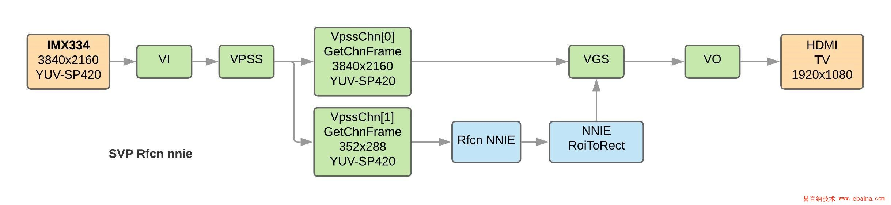

# Hisi NNIE实时识别

## 海思NNIE例程

```shell
~ # ./sample_nnie_main
Usage : ./sample_nnie_main <index> 
index:
         0) RFCN(VI->VPSS->NNIE->VGS->VO).
         1) Segnet(Read File).
         2) FasterRcnnAlexnet(Read File).
         3) FasterRcnnDoubleRoiPooling(Read File).
         4) Cnn(Read File).
         5) SSD(Read File).
         6) Yolov1(Read File).
         7) Yolov2(Read File).
         8) LSTM(Read File).
```

## RFCN

RFCN例程中，VI模块绑定了VPSS模块，VI从摄像头输入一路1080P视频，经VPSS分解为两路，一路stBaseFrmInfo保持原来的1080P分辨率，一路stExtFrmInfo转为CIF(352x288)分辨率，stExtFrmInfo输入到NNIE模块SAMPLE_SVP_NNIE_Rfcn_Proc得到分类与框位置信息，再将框位置信息通过SAMPLE_COMM_SVP_NNIE_FillRect给到VGS模块画框，最后通过HI_MPI_VO_SendFrame发送到VO，在HDMI显示器上显示。测试表明处理一帧数据的时间约为89毫秒，即帧率为11帧左右。



需要注意的是RFCN的wk模型文件与后面1）~8）几个模型的wk模型文件的颜色格式是不同的，RFCN调用的wk文件是YVU420颜色空间，而1）~8）模型的是BGR颜色空间。原因是后面1）~8）的模型是通过读图片文件的方式，图片需为颜色空间为BGR的裸数据，后缀名为*.bgr格式。如果要使用1）~8）的模型对视频流数据（来源于VI或VDEC模块，即从摄像头输入或本地视频文件解码）进行处理，需要使用YVU420颜色空间的wk模型文件，否则模型处理会失败。

### 开发流程

### 后处理

1. 删除背景框`HxWx9`
2. NMS（Non-maximum suppression）：去除重合度大的框中分数低的那个
3. 取分数最大的K（TopK）个框 K=300

## YOLOv3

### 初始化

包括VI VO初始化、NNIE初始化、Yolov3模型加载、2个线程创建

1. VI VO线程

   ```shell
   1 HI_MPI_VPSS_GetChnFrame  获取图像数据
    
   2 HI_MPI_SYS_Mmap 映射虚拟内存指针
    
   3 图像格式转化   需要将420sp格式图像转化为bbbgggrrr格式图像
    
   4 利用vgs画框
    
   5 HI_MPI_VO_SendFrame
   ```


2. Yolov3处理线程

   ```shell
   1 将图像数据填充至相关结构体
    
   2 SAMPLE_SVP_NNIE_Forward
    
   3 SAMPLE_SVP_NNIE_Yolov3_GetResult
    
   4 SAMPLE_SVP_NNIE_Detection_Result_to_rect 结果保存在rect中
   ```

   

[参考]:https://blog.csdn.net/yunge812/article/details/103938693	"YOLOv3实时识别（实测8帧每秒）"